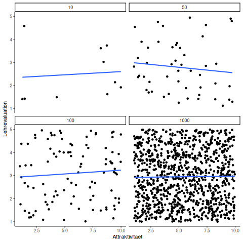

```{r setup, include=FALSE}
options(htmltools.dir.version = FALSE)
knitr::opts_chunk$set(warning = FALSE, message = FALSE, 
  comment = NA, dpi = 300,
  fig.align = "center", out.width = "70%", cache = FALSE)
library(tidyverse)
library(knitr)
library(emo)
library(extrafont)
library(xaringan)

ggplot2::theme_set(theme_minimal())
```

## Einführung

In der Datenanalyse möchten wir den Zusammenhang zwischen 

- der Ergebnisvariablen _y_ (auch abhängige Variable genannt)
- und einer erklärenden/vorhersagenden Variablen _x_ (auch unabhängige Variable genannt)

modellieren.

In der Mathematik wird dies oft beschrieben als:
Modellierung der abhängigen Variablen _y_ als Funktion der unabhängigen Variablen _x_.

---

## Zielsetzungen

- **Inferenz:** Beschreibung und Erklärung des Zusammenhangs von _y_ und _x_. Wenn möglich den kausalen Zusammenhang zwischen den zwei aufdecken.
- **Vorhersage:** Ergebnisvariable _y_ möglichst genau mit der verfügbaren Information aus _x_ vorhersagen. Hier ist das Zusammenspiel unterschiedlicher Variablen nicht so wichtig, hauptsache es wird die Vorhersagegenauigkeit gesteigert.

--

.instructions[Wir beschäftigen uns im folgenden mit der Inferenz und klammern die Vorhersage aus]

---

## Datensatz

.instructions[Das Konzept der Regressionsanalyse soll an einem anschaulichen Beispieldatensatz verdeutlicht werden]

--

Der Datensatz, welcher im folgenden verwendet wird beschäftigt sich mit der Lehrevaluation von 463 Vorlesungen an der University of Austin, Texas aus dem Jahr 2005.

Die Daten sind von [Openintro.org](https://www.openintro.org/stat/data/?data=evals).

```{r}
evals <- read_csv("data/evals.csv")
```

---

## Datensatz

Neben der Evaluation der Veranstaltung sind unter anderem _Attraktivität_, _Alter_, _Geschlecht_ und noch einige weitere Faktoren zum Dozent/der Dozentin erfasst worden.

Sie sollen sich im folgenden auf _Evaluation, _Attraktivität_, _Alter_ und _Geschlecht_ beschränken.

```{r}
used_evals <- evals %>%
  mutate(ID = rownames(evals),
         gender = as.factor(gender)) %>%
  select(ID, score, bty_avg, gender, age)
```

---

## Einführung

Zuerst sollten Sie sich einen Überblick über den Datensatz verschaffen

```{r, message=FALSE, warning=FALSE}
glimpse(used_evals)
```
--

- Im ersten Schritt sollten Sie sich **immer** die Rohdaten anzuschauen
--

- Im zweiten Schritt deskriptive Analysen erstellen
--

- Im dritten Schritt sollten Sie _explorative Grafiken_ erstellen

---

## Einführung

- `ID`: ID für jeden Kurs
- `score`: Durchschnittliches Evaluationsergebnis für diesen Kurs (nummerisch). Dieses möchten wir erklären, ist somit unsere _y_ Variable. 
  - Bester Wert ist 5, schlechtester 1.
- `btg_avg`: Durchschnittliche Attraktivität des Dozenten/der Dozentin, wie dieser von den Studenten eingeschätzt wurde (nummerisch). 1
  - Höchster Wert ist 10, niegrigster 1.
- `age`: Alter des Dozenten (nummerisch).
- `language`: Muttersprachler oder nicht (String-Variable)

---

## Einführung

Im nächsten Schritt sollten Sie erste deskriptive Analysen durchführen, um ihren Datensatz besser kennen zu lernen.

.tiny[
```{r,  render = knitr::normal_print}
library(skimr)
used_evals %>%
  skim()
```
]

---

## Einführung

Die bisherigen Analysen waren ausschließlich _univariat_, d.h. Sie betrachteten bisher immer nur die Variable, welche Sie interessiert. Jedoch ist das Zusammenspiel der Variablen mit anderen Variablen auch wichtig.

Im nächsten Schritt sollten Sie sich die _Korrelation_ zwischen unterschiedlichen Variablen anschauen, d.h. wie groß ist der lineare Zusammenhang zwischen zwei Variablen. 


---

## Korrelation

Den zuvor beschrieben Sachverhalt, dass attraktivere Dozenten/Dozentinnen bessere Lehrevaluationsergebnisse haben, können wir durch die Korrelation beschreiben.
Die Korrelation gibt an, wie zwei Variablen sich zueinander verhalten, wenn z.B. eine Variable sich um eine Einheit erhöht.

Der Korrelationskoeffizient für zwei Variablen $(x_1, y_1), \dots, (x_n,y_n)$ ist definiert als:

$$
\rho = \frac{1}{n} \sum_{i=1}^n \left( \frac{x_i-\mu_x}{\sigma_x} \right)\left( \frac{y_i-\mu_y}{\sigma_y} \right)
$$
mit $\mu_x, \mu_y$ als Mittelwerte von $x_1,\dots, x_n$ und $y_1, \dots, y_n$. 
$\sigma_x, \sigma_y$ sind die Standardabweichungen von diesem Mittelwert. 
$\rho$ wird üblicherweise genutzt um den Korrelationskoeffizienten zu bezeichnen. 

---

## Korrelation

Um zu verstehen, wie die Korrelation die Verbindung zwischen zwei Variablen widerspiegelt können wir die Formel in ihre Bestandteile zerlegen:

- Gegeben wir schauen uns den $i$-ten Eintrag von $x$ an. Dieser ist $\left( \frac{x_i-\mu_x}{\sigma_x} \right)$ Standardabweichungen entfernt vom Mittelwert von $x$.
- Weiterhin betrachten wir den $i$-ten Eintrag von $y$, welcher mit $x_i$ verbunden ist. Dieser ist $\left( \frac{y_i-\mu_y}{\sigma_y} \right)$ Standardabweichungen vom Mittelwert von $y$ entfernt. 
- Gegeben $x$ und $y$ stehen in keiner Beziehung zueinander, dann ist das Produkt $\left( \frac{x_i-\mu_x}{\sigma_x} \right)\left( \frac{y_i-\mu_y}{\sigma_y} \right)$ im Durchschnitt 0. Das heißt bei unkorrelierten Zufallsvariablen ist der Korrelationskoeffizient 0.
- Wenn beide Variablen auf gleiche Weise variieren, dann ist der Korrelationskoeffizient positiv
- Wenn beide Variablen auf entgegengesetzte Weise variieren, dann ist der Korrelationskoeffizient negativ

---

## Korrelation

Im extrem variiert die Korrelation von zwei Variablen zwischen -1 und 1.
Um dies zu sehen schauen wir uns den Fall von perfekter Korrelation an. D.h. wenn $x$ um eine Einheit steigt, dann steigt gleichzeitig $y$ um eine Einheit.

Hierbei ergibt sich die Korrelation als:

$$\rho = \frac{1}{n} \sum_{i=1}^n \left( \frac{x_i-\mu_x}{\sigma_x} \right)^2 = 1/\sigma^2 
\frac{1}{n} \sum_{i=1}^n \left( x_i-\mu_x \right)^2 = 1$$

---

## Korrelation - Simulation verschiedener Korrelationen

```{r, echo=FALSE, cache=TRUE}
n <- 1000
cors <- c(-1,0,1)
sim_data <- lapply(cors,function(r) MASS::mvrnorm(n,c(0,0), matrix(c(1,r,r,1),2,2)))
sim_data <- Reduce(rbind, sim_data)
sim_data <- cbind( rep(cors, each=n), sim_data)
colnames(sim_data) <- c("r","x","y")
as.data.frame(sim_data) %>% 
  ggplot(aes(x,y)) +facet_wrap(~r) + 
  geom_point() +
  geom_vline(xintercept = 0,lty=2) + 
  geom_hline(yintercept = 0,lty=2) 
```

---

## Korrelation

Die Korrelation zwischen der Attraktivität des Dozenten/der Dozentin und der Lehrevaluation liegt etwas über 18%. Der Zusammenhang ist schwach positiv.

```{r}
used_evals %>% summarize(cor(bty_avg, score))
```

---

## Stichprobenkorrelation

In empirischen Arbeiten können wir leider sehr selten die Gesamtpopulation betrachten, sondern nur eine Stichprobe daraus. Deshalb sind die von uns berechneten Mittelwerte und Standardabweichungen auch immer Zufallsvariablen.

- Wir müssen in unseren Analysen die **Stichproben**korrelation ( $\hat{\rho}$ ) als Schätzer für die Korrelation der Gesamtpopulation heranziehen
- Dadurch ergibt sich: Die **Stichprobenkorrelation** ist eine Zufallsvariable!

---

## Stichprobenkorrelation

Das Verständnis der Stichprobenkorrelation kann gut durch die Stichprobengröße dargestellt werden.

Für das folgende Schaubild wurden aus einer Gleichverteilung zehn mal **unabhängig** zwei Zufallszahlen simuliert. Die Stichprobengröße wurde für jedes der Schaubilder variiert: Sie ist 10, 50, 100 und 1000 Beboachtungen groß.

--

Insbesondere bei kleiner Stichprobenzahl scheint es öfter einen Zusammenhang zwischen den Variablen zu geben. 
Der Code auf der folgenden Folie wurde dazu genutzt die Stichprobenkorrelation als GIF zu veranschaulichen. Das Beispiel ist aus [diesem hervorragenden Buch](https://crumplab.github.io/statistics/) von Matthew J.C. Crump entnommen.

---

## Stichprobenkorrelation


```{r, echo=FALSE, eval=FALSE}
library(gganimate)
library(transformr)
all_df<-data.frame()
for(sim in 1:10){
  for(n in c(10,50,100,1000)){
  Attraktivitaet <- runif(n,1,10)
  Lehrevaluation <- runif(n,1,5)
  t_df<-data.frame(nsize=rep(n,n),
                   simulation=rep(sim,n),
                                  Attraktivitaet,
                                  Lehrevaluation)
  all_df<-rbind(all_df,t_df)
  }
}


animated_cor <- ggplot(all_df,aes(x=Attraktivitaet,y=Lehrevaluation))+
  geom_point() +
  geom_smooth(method=lm, se=FALSE) +
  theme_classic( )+
  facet_wrap(~nsize) +
  transition_states(
    simulation,
    transition_length = 2,
    state_length = 1
  ) +
  enter_fade() + 
  exit_shrink() +
  ease_aes('sine-in-out')

animate(animated_cor)
anim_save("../figs/correlations.gif")
```



---

## Anscombe-Quartett

.alert[Bei der Beschreibung ihres Datensatzes sollten Sie sich nicht nur auf deskriptive Statistiken, wie z.B. Mittelwert, Standardabweichung und Korrelation verlassen.]

**Anscombes Quartett:**

```{r ,echo=FALSE, out.width='50%'}
anscombe %>% mutate(row = seq_len(n())) %>%
  gather(name, value, -row) %>% 
  separate(name, c("axis", "group"), sep=1) %>%
  spread(axis, value) %>% select(-row) %>%
  ggplot(aes(x,y)) +
  facet_wrap(~group)  +
  geom_smooth(method="lm", fill=NA, fullrange=TRUE) +
  geom_point(cex=3,pch=21)
```

---

## Anscombe-Quartett

Vier verschiedene Stichproben mit gleicher Korrelation, Mittelwert und Standardabweichung.

--

.instructions[Machen Sie sich selbst ein Bild ob alle Datensätze gleich aussehen]

--

.instructions[**Take-away:** Visualisieren Sie ihre Daten!]

---

## Explorative Grafik

```{r scatterplot, fig.width=10, fig.height=5}
used_evals %>%
  ggplot(aes(x = bty_avg, y = score)) +
  geom_point() +
  labs(x = "Attraktivität", y = "Lehrevaluations",
       title = "Zusammenhang zwischen Lehrevaluation und Attraktivität des Dozenten")
```


