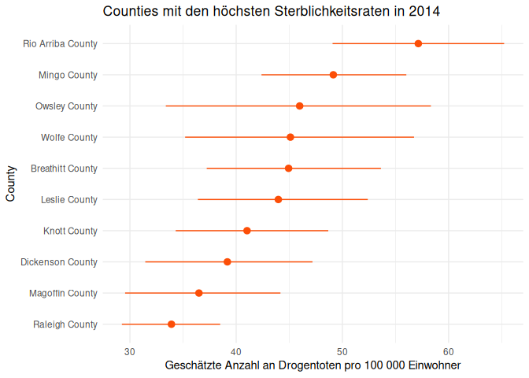
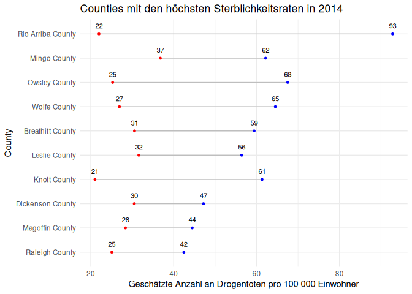
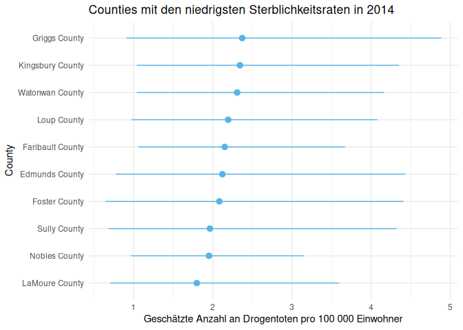
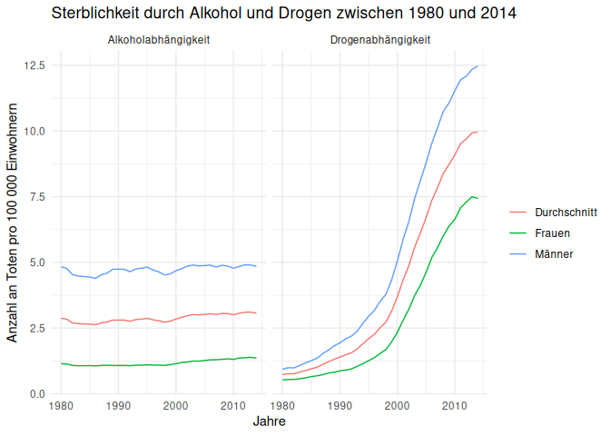
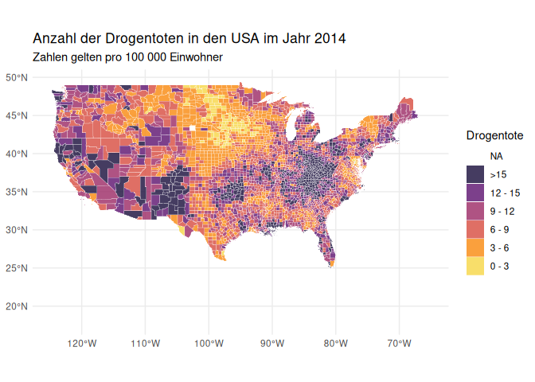
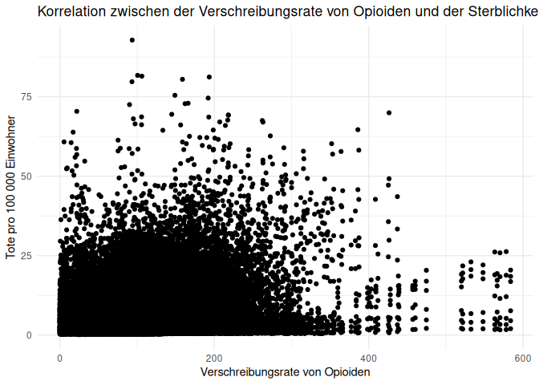

# Motivation

President Trump verhängte am 17. Oktober 2017 den nationalen Gesundheitsnotstand. Der Grund: Die Opioidkrise in den USA.
Die Pharma Industrie, insbesondere Purdue Pharma und die Inhaberfamilie Sackler, stehen seit Jahren im Fokus der amerikanischen Öffentlichkeit. Interne Dokumente belegen, dass Purdue Pharma, Produzent des Schwerzmittels Oxycontin (ein sehr starkes, legales Schmerzmittel auf Opioidbasis) gewusst hat, wie stark abhängig ihre Medikamente machen. Schlimmer noch, es wurde daran geforscht ein Medikament auf den Markt zu bringen, mit dem die Sucht bekämpft werden kann. D.h. Purdue Pharma wollte an dem Leid der Menschen doppelt verdienen. Problematisch ist neben der zunehmenden Medikamentenabhängigkeit eines immer größeren Teils der amerikanischen Bevölkerung auch das Abdriften in die Drogensucht, insbesondere da amerikanische Ärzte in den letzten Jahren Medikamente nicht mehr so leicht verschrieben haben. Drogensucht, insbesondere Heroin tritt hier oft an die Stelle der Medikamentensucht. Zusammengenommen zieht die Opioidkrise damit immense ökonomische Kosten nach sich, die [eine Studie der Society of Actuaries aus dem Jahr 2019](https://www.soa.org/globalassets/assets/files/resources/research-report/2019/econ-impact-non-medical-opioid-use.pdf) auf $631 Milliarden für die Jahre 2015 - 2018 beziffert. 

In diesem Projekt werden Sie untersuchen, ob es einen Zusammenhang zwischen der Verschreibung von Opioiden in einzelnen Counties der USA und den Drogentoten in diesen Counties gibt. Hierzu werten Sie öffentlich zugänglich Informationen der amerikanischen Gesundheitsbehörde aus.


```r
library(tidyverse)
library(rvest)
library(purrr)
library(pander)
library(skimr)
library(sf)
library(ggalt)
library(corrr)
library(stargazer)
```

# Daten

## Datengrundlage

Zunächst müssen Sie die für ihre Fragen relevanten Daten beschaffen. Hierbei werden Sie auf der Seite des [Institute for Health Metrics and Evaluation](http://ghdx.healthdata.org/us-data) fündig. Diese Seite liefert ihnen Informationen über die Sterblichkeit von US-Amerikanern auf der Basis ganz unterschiedlicher Krankheiten.

1. Sie interessieren sich insbesondere für Daten zu den "Substance use disorders". Laden Sie sich alle Informationen zu den "Substance use disorder", unterteilt für die US-Counties von 1980 - 2014 herunter und lesen Sie diese in R ein. Die _Anzahl der Drogentoten wird hier pro 100 000 Personen_ angegeben. Sie sollten alle Einzeldateien am Ende zu **einem Datensatz** verbinden, welcher die Anzahl der Toten für Alkoholsucht als auch Drogensucht (cause_id == 560 und cause_id == 561) für alle Counties seit 1980 - 2014 beinhaltet. Nennen Sie diesen Datensatz `Drogen_Tote`. Behalten Sie im Enddatensatz `Drogen_Tote` _nur die Variablen_ `Location_name`, `FIPS`, `cause_name`, `sex`, `year_id`, `mx`, `lower` und `upper`.


```r
# Neuer temporärer Ordner erstellen
dir.create("./data/health_metrics/")

# Download der Dateien von "Institute for Health Metrics and Evaluation" über "Substance use disorder"

download.file("http://ghdx.healthdata.org/sites/default/files/record-attached-files/IHME_USA_COUNTY_USE_INJ_MORTALITY_1980_2014_STATES_A_TO_F_CSV.zip", "./data/health_metrics/Drug-Mortality_1980-2014_A-F.csv.zip")

download.file("http://ghdx.healthdata.org/sites/default/files/record-attached-files/IHME_USA_COUNTY_USE_INJ_MORTALITY_1980_2014_STATES_G_TO_L_CSV.zip", "./data/health_metrics/Drug-Mortality_1980-2014_G-L.csv.zip")

download.file("http://ghdx.healthdata.org/sites/default/files/record-attached-files/IHME_USA_COUNTY_USE_INJ_MORTALITY_1980_2014_STATES_M_TO_N_CSV.zip", "./data/health_metrics/Drug-Mortality_1980-2014_M-N.csv.zip")

download.file("http://ghdx.healthdata.org/sites/default/files/record-attached-files/IHME_USA_COUNTY_USE_INJ_MORTALITY_1980_2014_STATES_O_TO_S_CSV.zip", "./data/health_metrics/Drug-Mortality_1980-2014_O-S.csv.zip")

download.file("http://ghdx.healthdata.org/sites/default/files/record-attached-files/IHME_USA_COUNTY_USE_INJ_MORTALITY_1980_2014_STATES_T_TO_W_CSV.zip", "./data/health_metrics/Drug-Mortality_1980-2014_T-W.csv.zip")
```


```r
# Neuer temporärer Ordner erstellen
dir.create("./data/tmp/")
zipped_files <- list.files("./data/health_metrics/")

for (i in zipped_files){
  unzip(paste0("./data/health_metrics/",i), exdir = "./data/tmp/")
}
# Daten in den temporären Ordner entzippen

# Auflisten welche Files im temporären Ordner sind
files <- list.files(path = "./data/tmp/")

# Diese Files einlesen
Drogen <- map_df(paste("./data/tmp/", files, sep = "/"), read_csv)

# Temporärer Ordner wieder löschen
unlink("./data/tmp/", recursive = TRUE)

# Nur die in der Aufgabenstellung erwähnten Variablen berücksichtigen
Drogen_Tote <- Drogen %>%
  select(c(location_name, FIPS, cause_name, cause_id, sex, year_id, mx, lower, upper)) %>%
  filter(cause_id == 560 | cause_id == 561)
```

Weiterhin sollten Sie sich Informationen zu den Verschreibungen von opioiden Schmerzmitteln herunterladen. Diese stellt das _Center for Disease Control and Prevention_ auf [ihrer Internetseite](https://www.cdc.gov/drugoverdose/maps/rxrate-maps.html) zwischen 2006 - 2017 für 87.6% - 94.0% aller U.S. counties zur Verfügung (laut eigenen Angaben). Die angegebene "Prescribing rate" wurde als _Verschreibungen pro 100 U.S. Bürger_ berechnet. 

2. Laden Sie die Daten zur _Prescribing rate_ (`prescribing`) für alle verfügbaren Counties zwischen den Jahren 2006 und 2014 herunter und lesen Sie diese in R ein. Erstellen Sie hierzu einen eigenen Datensatz `Opioid_Verschreibungen`. Achten Sie darauf das Jahr der Tabelle immer als neue Variable `year_id` abzuspeichern. Weiterhin sollten Sie die Spalte `FIPS County Code` mit `FIPS` benennen. Stellen Sie sicher, dass `FIPS` nummerisch gespeichert wurde. Der Datensatz `Opioid_Verschreibungen` sollte nur die `FIPS`, die `prescribing_rate` und die `year_id` enthalten.

_Hinweis:_ Arbeiten Sie sich zunächst in das Paket [`rvest`](https://github.com/hadley/rvest) ein. Hierzu finden Sie eine Einführung auf unserem [Github Repositorium.](https://github.com/AlexRieber/datascience-teaching/tree/master/2020/tutorials/rvest)


```r
#Download der Daten zu Verschreibung von Opioiden
#Jahr von welchem die Daten sind in URL -> darüber eine for-Schleife
dir.create("./data/cdc/")

for (year in 2006:2017){
  download.file(paste0("https://www.cdc.gov/drugoverdose/maps/rxcounty", year,".html"), paste0("./data/cdc/rxcounty",year,".html"))
}

# Zum Abschluss die Rohdaten zippen um den Speicherplatz gering zu halten
zip(zipfile = './data/cdc.zip', files = "./data/cdc/")

# CDC Ordner löschen und nur noch cdc.zip behalten
unlink("./data/cdc/", recursive = TRUE)
```


```r
#Funktion schreiben um die Daten auszulesen
get_prescribtions <- function(html){
  Opioidjahr <- read_html(html)
  jahr <- Opioidjahr %>%
    html_node("table") %>%
    html_table
  
  jahr %>%
    mutate(County = str_extract(County, "[^,]+"),
           prescribing = as.numeric(ifelse(jahr[,4] == "–", NA, jahr[,4])),
           year_id = as.numeric(str_match(html, "rxcounty(.*?).html")[,2])) %>%
    select( -ends_with("Rate") )
}

# Daten in einen temporären Ordner entzippen
dir.create("./data/tmp/")
unzip("./data/cdc.zip", exdir = "./data/tmp/")

#Das erste Jahr auslesen und in Opioid_Verschreibungen als Tibble speichern, dazu die vorherige Funktion nutzen
Opioid_Verschreibungen <- get_prescribtions(paste0("./data/tmp/data/cdc/rxcounty2006.html"))

# Die restlichen Jahre auslesen und diese dem Datensatz hinzufügen, dazu die vorherige Funktion nutzen

for (year in 2007:2014){
  Opioid_Verschreibungen <- bind_rows(Opioid_Verschreibungen, get_prescribtions(paste0("./data/tmp/data/cdc/rxcounty",year,".html")))
}

# Temporärer Ordner wieder löschen
unlink("./data/tmp/", recursive = TRUE)

Opioid_Verschreibungen <- Opioid_Verschreibungen %>%
  rename( FIPS = `FIPS County Code`) %>%
  select(c(prescribing, year_id, FIPS))
```
Damit Sie die vorhandenen Daten auswerten können müssen Sie diese zuerst zu einem Datensatz verbinden, auf welchem Sie ihre Analyse tätigen können.

3. Verbinden Sie den Datensatz `Drogen_Tote` mit dem Datensatz `Opioid_Verschreibungen` mittels der Variablen `FIPS` und `year_id`. Nennen Sie ihren neuen Datensatz `Drogen_Analyse`.


```r
Drogen_Analyse_gesamt <- left_join(Drogen_Tote, Opioid_Verschreibungen, by = c("FIPS", "year_id"))
saveRDS(Drogen_Analyse_gesamt, "./data/Drogen_Analyse_gesamt.rds")
```

# Deskriptive Analyse

Sie sollten sich im ersten Schritt einen Überblick über ihre Daten verschaffen. Betrachten Sie für ihre Analysen nur die Jahre 2006 bis 2014, da Sie hier über Daten zur Verschreibungsrate pro County und der Anzahl an Drogentoten verfügen.

4. Erstellen Sie eine Tabelle mit ersten deskriptiven Informationen über ihren Datensatz. Diese Tabelle sollte die Anzahl der Beobachtungen, den Mittelwert, die Standardabweichung, den Median, sowie Minimum und Maximum für die Variablen `mx` und `prescribing` enthalten.


```r
Drogen_Analyse <- Drogen_Analyse_gesamt %>%
  filter( year_id >=2006 & year_id <= 2014)

deskriptive_tabelle <- Drogen_Analyse %>%
  select(mx, prescribing, sex) %>%
  group_by(sex) %>%
  skim_without_charts()

deskriptive_tabelle
```


Table: Data summary

                                      
-------------------------  -----------
Name                       Piped data 
Number of rows             172476     
Number of columns          3          
_______________________               
Column type frequency:                
numeric                    2          
________________________              
Group variables            sex        
-------------------------  -----------


**Variable type: numeric**

skim_variable   sex       n_missing   complete_rate    mean      sd     p0     p25     p50      p75     p100
--------------  -------  ----------  --------------  ------  ------  -----  ------  ------  -------  -------
mx              Both              0            1.00    6.00    5.09   0.63    2.46    4.28     8.06    60.75
mx              Female            0            1.00    3.95    3.96   0.18    0.98    2.50     5.80    41.94
mx              Male              0            1.00    8.09    6.54   1.07    3.76    6.04    10.42    92.82
prescribing     Both           7606            0.87   89.22   48.22   0.00   57.60   82.90   113.60   583.80
prescribing     Female         7606            0.87   89.22   48.22   0.00   57.60   82.90   113.60   583.80
prescribing     Male           7606            0.87   89.22   48.22   0.00   57.60   82.90   113.60   583.80

---

> Die Tabelle zeigt die Verschreibungsrate (prescribing) von Opioiden Schmerzmitteln pro 100 Einwohnern, wie auch die Sterblichkeit pro 100 000 Einwohner, für Männer, Frauen und den Durchschnitt beider Geschlechter an. Insgesamt umfasst der Datensatz 172476 Beobachtungen von 2006 bis 2014. Da die Verschreibungsrate nicht für jedes County vorliegt gibt es hier weniger Beobachtungen in unserem Datensatz als für die Drogentoten. Die Verschreibungsrate ist pro County berechnet und nicht nach Frauen und Männern untergliedert, daher ergeben sich für alle Gruppen recht hohe durchschnittliche Verschreibungsraten von 89.2 Verschreibungen pro 100 Personen. Im 75% Quantil ist diese sogar bereits bei 114 Verschreibungen pro 100 Einwohnern. Die Sterberate pro 100 000 Einwohnern liegt bei Männern im Durchschnitt fast doppelt so hoch als bei Frauen (8.09 vs. 3.95) und in einem County ist die Sterberate in einem Jahr sogar bei 92.8 pro 100 000 Einwohner. Zum Vergleich: Die aktuelle Sterberate für Corona (Stand 10.05.2020) beträgt für Deutschland im Durchschnitt 8.77 pro 100 000 Einwohner.

---

Im nächsten Schritt geht es darum sich visuell mit den Daten vertraut zu machen. Hierfür sollten Sie sich zunächst nur auf das Jahr 2014 konzentrieren, das aktuellste Jahr in den vorliegenden Daten.

5. Visualisieren Sie die zehn Counties mit den meisten Drogentoten (Gesamtzahl in dem County) in 2014. Ihre Grafik sollte den Namen des Counties und die Anzahl der Drogentoten beinhalten. Konzentrieren Sie sich auf die Drogentoten und lassen Sie die anderen Gründe im Datensatz vorerst außen vor. Erstellen Sie eine Grafik mit allen Personen ( _nicht_ unterteilt nach Geschlecht) und beachten Sie auch die Konfidenzintervalle (`lower` und `upper`).


```r
top10 <- Drogen_Analyse %>%
  filter( year_id == 2014 & cause_name == "Drug use disorders" & sex == "Both") %>%
  mutate(country = reorder(location_name, mx)) %>%
  arrange(desc(country)) %>%
  slice(1:10) %>%
  ggplot(aes(x=country, y= mx)) +
  geom_point( col = "#FC4E07") +
  geom_pointrange(aes(ymin=lower, ymax=upper),  col = "#FC4E07") +
  labs(title = "Counties mit den höchsten Sterblichkeitsraten in 2014", 
       x = "County", 
       y = "Geschätzte Anzahl an Drogentoten pro 100 000 Einwohner") +
  theme_minimal() +
  coord_flip() 

top10
```

<!-- -->

```r
ggsave("./screencast/figs/top10_death.png", dpi = 300)
```

---

> Im Schaubild sind die zehn Counties mit den meisten Drogentoten in 2014 dargestellt. Mit geschätzten 57 Drogentoten pro 100 000 Einwohner hat Rio Arriba County die höchste Sterberate, auf Platz 10 liegt Raleigh County mit geschätzten 34 Drogentoten pro 100 000 Einwohnern. Die angegebenen Konfidenzbänder sind alle recht weit, allerdings haben alle hier aufgeführten Counties eine Sterberate von über 25 Personen pro 100 000 Einwohner. Die Unterschiede der Todesraten sind jedoch bei den Top10 bereits sehr hoch, d.h. es gibt nicht die eine Opioidkrise in Amerika, sondern jedes County ist unterschiedlich stark betroffen. Auffällig ist zudem, dass es sich bei den meisten dieser Counties um Indianerreservate bzw. um dünnbesiedelte Counties handelt. Die Arbeitslosenquote ist in diesen Counties sehr hoch und die durchschnittlichen Einkommen liegen weit unter dem nationalen Durchschnitt. 

---

6. In ihrem Datensatz haben Sie Informationen zu den Drogentoten, unterschieden nach Frauen und Männern. Um zu veranschaulichen, welches Geschlecht eher von der Opioid-Krise betroffen ist sollten Sie eine Grafik erstellen, in der Sie die Anzahl Drogentoten für Frauen und Männer einander gegenüberstellen. Hierzu eignet sich insbesondere das [Dumbbell Chart](https://www.rdocumentation.org/packages/SciencesPo/versions/1.4.1/topics/geom_dumbbell). 


```r
# Für den Dumbell Plot müssen die Daten im wide Format vorliegen, jedoch benötigen wir hier nur ein paar Variablen des Datensatzes, d.h. mx, year_id, cause_name, sex und country
# Diese Art die Daten zu reshapen kommt ohne `pivot_wider` aus. Damit ginge es nämlich auch:
dumbbell_men <- Drogen_Analyse %>%
  select(mx, year_id, cause_id, sex, FIPS, location_name) %>%
  filter( sex == "Male" & cause_id==561)

dumbbell_women <- Drogen_Analyse %>%
  select(mx, year_id, cause_id, sex, FIPS) %>%
  filter( sex == "Female" & cause_id == 561)

# Abgespeckter Datensatz, hier benötigen wir auch keine Geschlechter mehr, sondern nur die Variablen der Sterblichkeit
dumbbell <- left_join(dumbbell_men, dumbbell_women, by = c("FIPS", "year_id")) %>%
  rename( mx.men = mx.x,
          mx.women = mx.y) %>%
  select(-c(cause_id.x, cause_id.y, sex.x, sex.y))

plot_dumbell <- dumbbell %>%
  filter( year_id == 2014) %>%
  mutate(country = reorder(location_name, (mx.men+mx.women))) %>%
  arrange(desc(country)) %>%
  slice(1:10) %>%
  ggplot(aes(x=mx.women, xend=mx.men, y=country)) +
  geom_dumbbell(size = 0.5,
                size_x = 1, 
                size_xend = 1,
                colour = "grey", 
                colour_x = "red", 
                colour_xend = "blue") +
  geom_text(aes(x=mx.women, y=country, label=round(mx.women,0)), size=3, vjust = -1) +
  geom_text(aes(x=mx.men, y=country, label=round(mx.men,0)), size=3, vjust = -1) +
  labs( title = "Counties mit den höchsten Sterblichkeitsraten in 2014",
        y = "County",
        x = "Geschätzte Anzahl an Drogentoten pro 100 000 Einwohner") +
  theme_minimal()

plot_dumbell
```

<!-- -->

```r
ggsave("./screencast/figs/dumbell_chart.png", dpi = 300)
```

Gehen Sie auf die Unterschiede zwischen Frauen und Männern kurz ein. Was könnten ihrer Meinung nach Gründe für die hohe Anzahl an Drogentoten, insbesondere in den ersten 5 Counties sein? Recherchieren Sie die Bevölkerungszusammensetzung und mittleren Einkommen der 5 Counties, welche in ihrer Grafik oben stehen und interpretieren Sie ihre Grafik.

---

> Die Sterberate ist für die zehn betrachteten Counties durchgehend für Männer höher als für Frauen. Zudem ist die Varianz der Sterberaten bei Frauen geringer als bei Männern. Die ersten 5 Counties liegen mit Ausnahme von Rio Arriba County an der Grenzregion von Kentucky und West Virginia im Osten der USA. Diese Counties haben durchweg eine geringe Bevölkerungsdichte (ca. 10 Einwohner/km2) und ein Median Haushaltseinkommen zwischen 20 000 und 30.000 USD/Jahr (im Vergleich zu über 60.000 USD/Jahr für die gesamte USA). Weiterhin haben die Counties Rio Arriba County und Mingo County einen relativ hohen Anteil an indigener Bevölkerung. Große Teile von Kentucky sind als sogenannte Dry Counties deklariert in denen Alkoholkonsum teilweise oder sogar komplett untersagt ist. Auch wenn diese Grafik aufzeigt, dass Männer viel mehr Drogentote pro 100 000 Einwohner in diesen Counties aufweisen als Frauen, so sollten Sie immer bedenken, dass auch 20 Drogentote pro 100 000 Einwohner sehr viel ist. Da in den Top 10 der Counties mit den höchsten Sterblichkeitsraten nur sozial schwache Counties vorzufinden sind liegt die Vermutung nahe, dass die Opioidkrise auch eine soziale Krise innerhalb Amerikas ist. 

---

7. Visualisieren Sie demgegenüber die zehn Counties mit den geringsten Drogentoten in 2014 für beide Geschlechter zusammengefasst. Ihre Grafik sollte den Namen des Counties, den Bundesstaat und die Anzahl der Drogentoten beinhalten. Fügen Sie bitte weiterhin das Konfidenzintervall hinzu (`upper` und `lower`). Lassen Sie die Alkoholtoten vorerst außen vor. Recherchieren Sie die Bevölkerungszusammensetzung und mittleren Einkommen der 5 Counties, welche in ihrer Grafik oben stehen und interpretieren Sie ihre Grafik.


```r
#Niedrigste Sterblichkeitsrate in 2014 für Drogentote
bottom10 <- Drogen_Analyse %>%
  filter( year_id == 2014 & cause_name == "Drug use disorders" & sex == "Both") %>%
  mutate(country = reorder(location_name, mx)) %>%
  arrange(country) %>%
  slice(1:10) %>%
  ggplot(aes(x=country, y= mx)) +
  geom_point( col = "#56B4E9") +
  geom_pointrange(aes(ymin=lower, ymax=upper),  col = "#56B4E9") +
  labs( title = "Counties mit den niedrigsten Sterblichkeitsraten in 2014", 
        x = "County",
        y = "Geschätzte Anzahl an Drogentoten pro 100 000 Einwohner") +
  theme_minimal() +
  coord_flip() 

bottom10
```

<!-- -->

```r
ggsave("./screencast/figs/bottom10_death.png", dpi = 300)
```

---

> Wie bereits bei der vorherigen Grafik vermutet findet sich in den 10 Counties mit den wenigsten Drogentoten pro 100 000 Einwohner nur Counties, welche ein Median Haushaltseinkommen von mindestens 50 000 USD pro Jahr aufweisen. Hier zeigt sich die enorme Bandbreite an Drogentoten in den USA. In den 10 Counties mit den meisten Drogentoten werden durchschnittlich über 55 Tote pro 100 000 Einwohner registriert, und in diesen Counties rund 2 pro 100 000 Einwohner. 

---

Nun haben Sie sich das aktuellste Jahr in ihren Daten angeschaut. Jedoch wollen Sie etwas über die Entwicklung der Opioid-Krise in den USA lernen.

8. Berechnen Sie sich die durchschnittliche Sterblichkeit zwischen 1980 - 2014 über alle Counties. Erstellen Sie anschließend eine Grafik, in der Sie die durchschnittliche Sterblichkeit visualisieren. Unterscheiden Sie in ihrer Grafik nach den Geschlechtern. Weiterhin sollten Sie _je eine_ Grafik für
    a) Drogentote durch Alkohol
    b) Drogentote durch Drogen


```r
#Neue Variable definieren
Drogen_Analyse_gesamt <- Drogen_Analyse_gesamt %>%
  group_by(year_id, sex, cause_name) %>%
  mutate( avg_mx = mean(mx)) %>%
  ungroup() 

#Grafik erstellen
Drogen_Analyse_gesamt %>%
  mutate( cause_name_de = ifelse(cause_name=="Alcohol use disorders", "Alkoholabhängigkeit", "Drogenabhängigkeit"),
          sex_de = case_when(
            sex == "Both" ~ "Durchschnitt",
            sex == "Male" ~ "Männer",
            sex == "Female" ~ "Frauen"
          )) %>%
  ggplot(aes(x=year_id, y= avg_mx, color=sex_de)) +
  geom_line() +
  labs( title = "Sterblichkeit durch Alkohol und Drogen zwischen 1980 und 2014", 
        x = "Jahre", 
        y = "Anzahl an Toten pro 100 000 Einwohnern",
        color = "") +
  theme_minimal() +
  facet_wrap(~cause_name_de, ncol=2)
```

<!-- -->

erstellen und diese nebeneinander plotten. Seit 2014 hat sich die Lage weiterhin verschlimmert, wie Sie [hier](https://www.cdc.gov/nchs/data/databriefs/db329-h.pdf) sehen können. Interpretieren Sie ihre Grafik und erläutern Sie, was zu dem starken Anstieg an Drogentoten geführt haben könnte.

---

> In der vorliegenden Grafik werden die Toten pro 100 000 Einwohner zwischen 1980 bis 2014 abgetragen, welche auf Alkoholmissbrauch bzw. Drogenmissbrauch zurückzuführen waren. Auf der linken Seite sehen Sie die Todesrate auf Basis von Alkohol. Diese unterliegt im gesamten Zeitablauf nur geringen Schwankungen und es gibt keine systematische Zunahme der Alkoholtoten. Bei den Toten durch Drogenmissbrauch ergibt sich ein anderes Bild. Hier war die Todesrate in den 1980er Jahren sowohl für Frauen, als auch für Männer sehr gering (rund 1 pro 100 000). Dies änderte sich im Laufe der 1990er Jahre und steigt seit 2000 sehr stark an. Die Todesrate am aktuellen Rand liegt für Frauen bei 7,5 und Männer bei 12,5. [Auf den Seiten der CDC](https://www.cdc.gov/drugoverdose/epidemic/index.html) wird insbesondere seit 1999 auf eine höhere Rate von Drogentoten auf der Basis von verschreibungspflichtigen Medikamenten hingewiesen. Das in den 1990er Jahren stark beworbene Oxycontin (ein opioides Schmerzmittel) hatte hier wahrscheinlich einen hohen Anteil an der Zunahme der Drogentoten. Oxycontin wurde in den USA bereits bei [mäßigen Schmerzen](https://www.tandfonline.com/doi/abs/10.1185/03007990802584454?journalCode=icmo20) verabreicht und ist stark süchtig machend. Oxycontin wird von Purdue Pharma hergestellt.

---


9. Nun sollten Sie mittels der FIPS Codes und dem "US_County_Boundaries.shp", welche Sie auf [dieser Webseite](https://www.sciencebase.gov/catalog/item/4f4e4a2ee4b07f02db615738) finden können eine Karte der USA zeichnen und diese mit den Drogentoten pro 100 000 Einwohnern einfärben. Nutzen Sie hierfür die Daten aus 2014.


```r
drogentote_county <- left_join(US_Counties_Karte, Karte, by="FIPS") %>%
  mutate(mx = factor(case_when(
    mx <= 3 ~ "0 - 3",
    mx > 3 & mx <= 6 ~ "3 - 6",
    mx > 6 & mx <= 9 ~ "6 - 9",
    mx > 9 & mx <= 12 ~ "9 - 12",
    mx > 12 & mx <= 15 ~ "12 - 15",
    mx > 15  ~ ">15"
  ), levels = c("0 - 3","3 - 6","6 - 9","9 - 12","12 - 15",">15")))

plot_drogentote <- ggplot(
  # define main data source
  data = drogentote_county
) +
  geom_sf(
    mapping = aes(
      fill = mx
    ),
    color = "white",
    size = 0.1
  ) +
  # use the Viridis color scale
  scale_fill_viridis_d(
    option = "inferno",
    name = "Drogentote",
    alpha = 0.8, # make fill a bit brighter
    begin = 0.1,
    end = 0.9,
    direction = -1,
    guide = guide_legend(reverse = T)) +
  # add titles
  labs(x = NULL,
       y = NULL,
       title = "Anzahl der Drogentoten in den USA im Jahr 2014",
       subtitle = "Zahlen gelten pro 100 000 Einwohner") +
  theme_minimal()

plot_drogentote
```

<!-- -->

```r
ggsave("./screencast/figs/map_death.png", dpi = 300)
```

---

> In der vorliegenden Karte sehen Sie die Anzahl der Drogentoten pro 100 000 Einwohner in allen US Counties. Die durchschnittliche Bevölkerungszahl eines US-Counties beträgt 100 000 Einwohner. Jedes County ist entsprechend der Anzahl der Drogentoten im Jahr 2014 eingefärbt, wobei gilt je dunkler ein County, desto mehr Drogentote. Hierbei sehen wir vor allem im mittleren Westen, d.h. North und South Dakota, Minnesota, Nebraska etc. gibt es nur sehr wenige Drogentote. Die Hot-Spots liegen in den Regionen rund um das Appalachengebirge mit Kentucky, West Virginia und Ohio, aber auch New York oder im Osten New Mexiko, Oklahoma und Arizona haben sehr viele Drogentote. An der Karte erkennen wir sehr schön, dass es sich bei der Opioidkrise um ein Problem handelt, welches in ganz Amerika zu beobachten ist. Die vorherigen Grafiken deuten jedoch darauf hin, dass mit besonderer Härte ärmere und auch dünn besiedelte Counties betroffen sind.

---

 
10. Im nächsten Schritt sollten Sie sich die Korrelation der durchschnittlichen Drogentoten in einem County und der Verschreibungsrate von Opioiden Schmerzmitteln in diesem County für das Jahr 2014 anschauen. Erstellen Sie hierzu ein Streudiagramm, welches diesen Zusammenhang visualisiert und berechnen Sie den Korrelationskoeffizienten.
    - Erläutern Sie ihre Ergebnisse kurz.


```r
Drogen_Analyse %>%
  ggplot(aes(x = prescribing, y = mx)) + geom_point() + 
  labs( x = "Verschreibungsrate von Opioiden", 
        y = "Tote pro 100 000 Einwohner",
        title = "Korrelation zwischen der Verschreibungsrate von Opioiden und der Sterblichkeit") +
  theme_minimal()
```

<!-- -->


```r
korrelationen <- Drogen_Analyse %>%
  select(prescribing, mx) %>%
  correlate() %>% # Korrelationen erzeugen
  shave() # Oberen Teil der Tabelle abschneiden

pull(korrelationen[2,2])
```

```
## [1] 0.2440976
```

---

> In dem Streudiagramm sind auf der x-Achse die Verschreibung von Schmerzmitteln auf Opioidbasis abgetragen und auf der y-Achse die Toten pro 100 000 Einwohner. Wir erkennen einen leichten positiven Zusammenhang, was durch den Korrelationskoeffizienten von 0.244 bestätigt wird. Es ist nicht so, dass in jedem County, in dem es eine hohe Verschreibung von Opioiden Schmerzmitteln gab auch die Anzahl der Drogentoten in die Höhe schnellte, allerdings besteht eine positive Korrelation zwischen den beiden. Um den Zusammenhang interpretierbar darzustellen wollen wir im nächsten Abschnitt eine Regression durchführen.

---

# Regressionsanalyse

Bisher haben wir uns visuell einen Überblick über die Opioidkrise in Amerika verschafft. Hier haben wir einen ersten Hinweise darauf erhalten, dass Counties mit einer höheren Verschreibung von Medikamenten auf Opioid-Basis auch die Counties sind, in denen die Opioid-Krise besonders stark ist. Jedoch wollen wir die grafische Analyse noch durch eine Regressionsanalyse untermauern.

11. Führen Sie eine univariate Regression durch in der Sie die Anzahl der Drogentoten auf die Verschreibungsrate von Opiaten regressieren. Stellen Sie ihre Ergebnisse in einer Tabelle anschaulich dar.


```r
reg1 <- lm(mx ~ prescribing, data = filter(Drogen_Analyse, sex!="Both"))
```

12. Erweiteren Sie ihre Regression aus Aufgabe 11 und kontrollieren Sie nach dem Geschlecht. Stellen Sie ihre Ergebnisse in einer Tabelle anschaulich dar.


```r
Drogen_Analyse <- Drogen_Analyse %>%
  filter(sex!="Both") %>%
  mutate( women = ifelse(sex=="Female", 1,0))

reg2 <- lm(mx ~ prescribing + women, data=Drogen_Analyse)

stargazer(reg1,reg2, type = "html", header=FALSE)
```


<table style="text-align:center"><tr><td colspan="3" style="border-bottom: 1px solid black"></td></tr><tr><td style="text-align:left"></td><td colspan="2"><em>Dependent variable:</em></td></tr>
<tr><td></td><td colspan="2" style="border-bottom: 1px solid black"></td></tr>
<tr><td style="text-align:left"></td><td colspan="2">mx</td></tr>
<tr><td style="text-align:left"></td><td>(1)</td><td>(2)</td></tr>
<tr><td colspan="3" style="border-bottom: 1px solid black"></td></tr><tr><td style="text-align:left">prescribing</td><td>0.028<sup>***</sup></td><td>0.028<sup>***</sup></td></tr>
<tr><td style="text-align:left"></td><td>(0.0004)</td><td>(0.0003)</td></tr>
<tr><td style="text-align:left"></td><td></td><td></td></tr>
<tr><td style="text-align:left">women</td><td></td><td>-4.233<sup>***</sup></td></tr>
<tr><td style="text-align:left"></td><td></td><td>(0.033)</td></tr>
<tr><td style="text-align:left"></td><td></td><td></td></tr>
<tr><td style="text-align:left">Constant</td><td>3.570<sup>***</sup></td><td>5.686<sup>***</sup></td></tr>
<tr><td style="text-align:left"></td><td>(0.038)</td><td>(0.039)</td></tr>
<tr><td style="text-align:left"></td><td></td><td></td></tr>
<tr><td colspan="3" style="border-bottom: 1px solid black"></td></tr><tr><td style="text-align:left">Observations</td><td>99,772</td><td>99,772</td></tr>
<tr><td style="text-align:left">R<sup>2</sup></td><td>0.056</td><td>0.188</td></tr>
<tr><td style="text-align:left">Adjusted R<sup>2</sup></td><td>0.056</td><td>0.187</td></tr>
<tr><td style="text-align:left">Residual Std. Error</td><td>5.662 (df = 99770)</td><td>5.251 (df = 99769)</td></tr>
<tr><td style="text-align:left">F Statistic</td><td>5,867.423<sup>***</sup> (df = 1; 99770)</td><td>11,512.230<sup>***</sup> (df = 2; 99769)</td></tr>
<tr><td colspan="3" style="border-bottom: 1px solid black"></td></tr><tr><td style="text-align:left"><em>Note:</em></td><td colspan="2" style="text-align:right"><sup>*</sup>p<0.1; <sup>**</sup>p<0.05; <sup>***</sup>p<0.01</td></tr>
</table>

Interpretieren Sie ihre Ergebnisse:

- Kommentieren Sie die Koeffizienten der Regression. Was sind ihre Erwartungen bzgl. Vorzeichen und Sigifikanz der Koeffizienten gegeben ihrer vorherigen Analysen?
- Kommentieren Sie die t-Statistik und den Standardfehler des Koeffizienten

---

> Aufgabe 11: Wir regressieren die Drogentoten pro 100 000 Einwohner auf die Verschreibung von opioiden Schmerzmitteln pro 100 Einwohner. Der Koeffizient von `prescribing`, d.h. unserer Verschreibungsrate ist signifikant auf dem 1% Signifikanzniveau und liegt bei 0.028. Das bedeutet eine um Einheit höhere Verschreibungsrate pro 100 Einwohner korrespondiert mit im Durchschnitt 0.028 mehr Drogentoten pro 100 000 Einwohner. Um dies noch etwas anders auszudrücken könnten wir uns auch die Standardabweichung der Variablen `prescribing` aus unserer deskriptiven Tabelle (aus Aufgabe 4) näher anschauen. Diese beträgt 48,22, der Mittelwert der Variablen beträgt 89,22. Wenn wir nun von einem durchschnittlichen County, welches 89,22 Verschreibungen pro 100 Einwohner ausgehen und danach ein County betrachten, welches eine Standardabweichung mehr an opioide Schmerzmittel verschreibt, dann hat dieses County im Durchschnitt 0,028*48,22 = 1,35 Drogentote mehr pro 100 000 Einwohner als ein County mit einer durchschnittlichen Verschreibungsrate von opioiden Schmerzmitteln. Da die durchschnittliche Anzahl an Drogentoten in unserem Datensatz von 2006 bis 2014 bei 6,0 liegt (siehe deskriptive Tabelle aus Aufgabe 4 Zeile "both" bei `mx`) ist der Zusammenhang nicht unerheblich. Die Konstante gibt an, dass es bei einer Verschreibungsrate von 0 pro 100 Einwohnern im Durchschnitt 3,57 Drogentote pro 100 000 Einwohner geben würde. Jedoch deutet das geringe R² von 0.05 bereits darauf hin, dass es noch weitere Faktoren gibt, welche die Anzahl der Drogentoten mitbestimmen.

> Aufgabe 12: Da wir bereits in der Grafik zu Aufgabe 6 gesehen haben, dass Frauen wenier häufig an Drogen sterben, wollen wir auf Frauen in unserer Regression kontrollieren. Auch dieser Koeffizient ist signifikant auf dem 1% Niveau und wie erwartet stark negativ. Mit -4,233 ist der Koeffizient sehr groß und zeigt, dass Frauen deutlich weniger häufig an Drogen sterben als Männer. Bei einer Verschreibungsrate von 0 pro 100 Einwohner gebe es im Durchschnitt 5,686 männliche und 1,453 Drogentote pro 100 000 Einwohner. 

> Es gilt hier jedoch immer zu bedenken, dass wir die Ergebnisse aus den vorherigen Regressionen nicht kausal interpretieren können. Es gibt viele verschiedene Komponenten, welche eine Drogensucht begünstigen können, wie die Bildung, das Einkommen etc. Jedoch geben uns diese Ergebnisse einen Hinweis darauf, dass einen Zusammenhang zwischen der Verschreibungsrate von opioiden Schmerzmitteln und den Drogentoten vorhanden ist.

--- 
