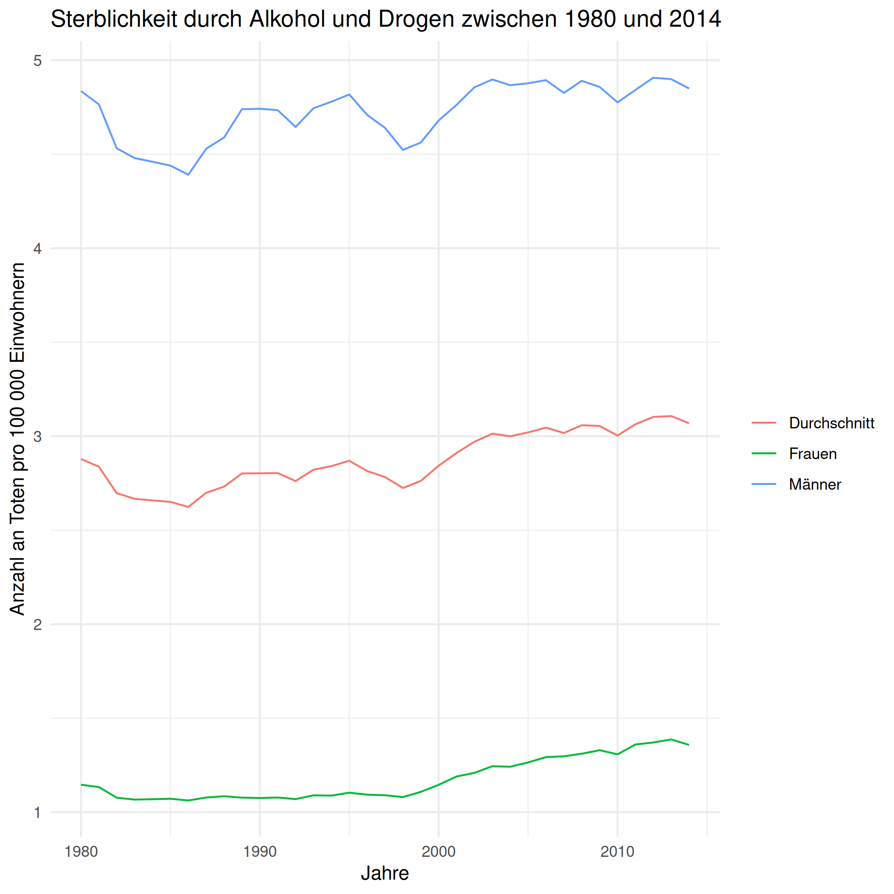

```{r, include=FALSE}
library(tidyverse)
library(sf)
```

```{r, echo=FALSE, eval=FALSE}
Drogen_Analyse_gesamt <- readRDS("../data/Drogen_Analyse_gesamt.rds")
Drogen_Analyse <- Drogen_Analyse_gesamt %>%
  filter( year_id >=2006 & year_id <= 2014)
```

# Fakten

.alert[Jeden Tag sterben 128 Personen an einer Opioid Überdosis (Stand 2018)]

--

.pull-left[
```{r, out.width='100%', fig.align='center', echo=FALSE}

```
]

--
.pull-right[
```{r, out.width='100%', fig.align='center', echo=FALSE}
knitr::include_graphics('https://resize.hswstatic.com/w_907/gif/10-causes-of-car-fires-4.jpg')
```
]

---

```{r, out.width='100%', fig.align='center', echo=FALSE}
knitr::include_graphics('https://www.cdc.gov/drugoverdose/images/epidemic/2018-3-Wave-Lines-Mortality.png')
```

---

# Verfügbare Daten

.instructions[Das _Institute for Health Metrics and Evaluation_ stellt Daten zu den Drogentoten von 1980 bis 2014 bereit]

.pull-left[
```{r, out.width='100%', fig.align='center', echo=FALSE, dpi=300, eval=FALSE}
#Neue Variable definieren
Drogen_Analyse_gesamt <- Drogen_Analyse_gesamt %>%
  group_by(year_id, sex, cause_name) %>%
  mutate( avg_mx = mean(mx)) %>%
  ungroup() 

#Grafik erstellen
Drogen_Analyse_gesamt %>%
  mutate( cause_name_de = ifelse(cause_name=="Alcohol use disorders", "Alkoholabhängigkeit", "Drogenabhängigkeit"),
          sex_de = case_when(
            sex == "Both" ~ "Durchschnitt",
            sex == "Male" ~ "Männer",
            sex == "Female" ~ "Frauen"
          )) %>%
  filter(cause_name_de == "Drogenabhängigkeit") %>%
  ggplot(aes(x=year_id, y= avg_mx, color=sex_de)) +
  geom_line() +
  labs( title = "Sterblichkeit durch Alkohol und Drogen zwischen 1980 und 2014", 
        x = "Jahre", 
        y = "Anzahl an Toten pro 100 000 Einwohnern",
        color = "") +
  theme_minimal()

ggsave("./figs/drugs.png", dpi = 300)
```
```{r, out.width='100%', fig.align='center', echo=FALSE}

```

]

--

.pull-right[
```{r, out.width='100%', fig.align='center', echo=FALSE, dpi=300, eval=FALSE}
#Grafik erstellen
Drogen_Analyse_gesamt %>%
  mutate( cause_name_de = ifelse(cause_name=="Alcohol use disorders", "Alkoholabhängigkeit", "Drogenabhängigkeit"),
          sex_de = case_when(
            sex == "Both" ~ "Durchschnitt",
            sex == "Male" ~ "Männer",
            sex == "Female" ~ "Frauen"
          )) %>%
  filter(cause_name_de == "Alkoholabhängigkeit") %>%
  ggplot(aes(x=year_id, y= avg_mx, color=sex_de)) +
  geom_line() +
  labs( title = "Sterblichkeit durch Alkohol und Drogen zwischen 1980 und 2014", 
        x = "Jahre", 
        y = "Anzahl an Toten pro 100 000 Einwohnern",
        color = "") +
  theme_minimal()

ggsave("./figs/alkohol.png", dpi = 300)
```

```{r, out.width='100%', fig.align='center', echo=FALSE}

```

]


---

```{r, out.width='100%', fig.align='center', echo=FALSE}

```

---

```{r, out.width='100%', fig.align='center', echo=FALSE}

```

---

```{r, out.width='100%', fig.align='center', echo=FALSE}

```

---

```{r, out.width='100%', fig.align='center', echo=FALSE}

```

---

# Verschreibung von Opiaten

```{r, echo=FALSE, include=FALSE, eval=FALSE}
# Daten in einen temporären Ordner entzippen
dir.create("../data/tmp/")
unzip("../data/maps/US_County_Boundaries.zip", exdir = "../data/tmp/")

# Hier die Karteninfos einlesen und Alaska und Hawaii raus nehmen der Übersichtlichkeit halber
US_Counties_Karte <- st_read("../data/tmp/US_County_Boundaries.shp") %>%
  mutate(FIPS = as.numeric(as.character(CTFIPS))) %>%
  filter( STATE != "Alaska" & STATE != "Hawaii")

# Temporärer Ordner wieder löschen
unlink("../data/tmp/", recursive = TRUE)

# Nur das Jahr 2014 für Drogentote über alle Personen
Karte <- Drogen_Analyse %>%
  filter( year_id == 2014 & sex == "Both") %>%
  select(FIPS, prescribing)
```

```{r, echo=FALSE, eval=FALSE}
verschreibung_county <- left_join(US_Counties_Karte, Karte, by="FIPS") %>%
  mutate(prescribing = factor(case_when(
    prescribing <= 30 ~ "0 - 30",
    prescribing > 30 & prescribing <= 60 ~ "30 - 60",
    prescribing > 60 & prescribing <= 90 ~ "60 - 90",
    prescribing > 90 & prescribing <= 120 ~ "99 - 120",
    prescribing > 120 & prescribing <= 150 ~ "120 - 150",
    prescribing > 150  ~ ">150"
  ), levels = c("0 - 30","30 - 60","60 - 90","90 - 120","120 - 150",">150")))

plot_verschreibung <- ggplot(
  # define main data source
  data = verschreibung_county
) +
  geom_sf(
    mapping = aes(
      fill = prescribing
    ),
    color = "white",
    size = 0.1
  ) +
  # use the Viridis color scale
  scale_fill_viridis_d(
    option = "inferno",
    name = "Verschreibungen",
    alpha = 0.8, # make fill a bit brighter
    begin = 0.1,
    end = 0.9,
    direction = -1,
    guide = guide_legend(reverse = T)) +
  # add titles
  labs(x = NULL,
       y = NULL,
       title = "Verschreibungen von Opioiden Schmerzmitteln im Jahr 2014",
       subtitle = "Zahlen gelten pro 100 Einwohner") +
  theme_minimal()

plot_verschreibung

ggsave("./figs/map_prescribing.png", dpi = 300)
```

```{r, out.width='100%', fig.align='center', echo=FALSE, dpi=300}

```


---

# Erkenntnisse aus unserer Analyse

- Signifikanter Zusammenhang zwischen der Verschreibungsrate von Opioiden und der Todesrate in den jeweiligen Counties
- Eine um 1 Einheit höhere Verschreibungsrate von Opioiden pro 100 Einwohner korrespondiert mit einer um 0,028 Personen höheren Todesrate pro 100 000 Einwohnern

.instructions[Counties mit einer um eine Standardabweichung höheren Verschreibungsrate von Opioiden korrespondieren im Durchschnitt mit 1,38 mehr Drogentoten pro 100 000 Einwohner!]

--

.alert[**Dennoch:** Verschreibung von Opioiden nicht grundsätzlich verbieten, sondern vernünftiger damit umgehen!]

---

```{r, out.width='100%', fig.align='center', echo=FALSE}

```


