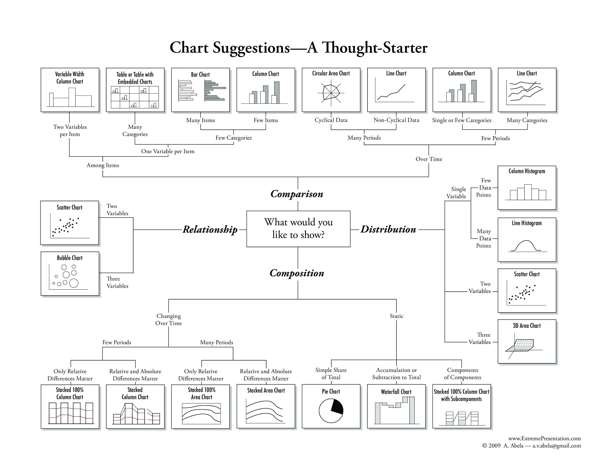
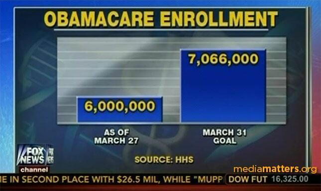
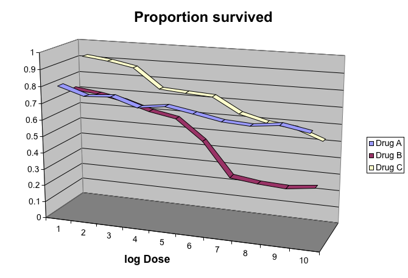

```{r setup, include=FALSE}
options(htmltools.dir.version = FALSE)
knitr::opts_chunk$set(warning = FALSE, message = FALSE, 
  comment = NA, dpi = 300,
  fig.align = "center", out.width = "70%", cache = FALSE)
library(tidyverse)
library(png) 
library(knitr)
library(xaringan)
library(gridExtra)
library(scales)
library(gganimate)

ggplot2::theme_set(theme_minimal())
# update those defaults
update_font_defaults <- function(font_choice = "Lato") {
    ggplot2::update_geom_defaults("text", list(family = font_choice))
    ggplot2::update_geom_defaults("label", list(family = font_choice))
    
}
theme_bakeoff <- function(font_choice = "Lato"){ 
  
  update_font_defaults()
  
  ggplot2::theme_minimal(base_family = font_choice)
  
}
ggplot2::theme_set(theme_bakeoff())

gif_link <- function(link, file, size){
    knitr::asis_output(
      paste0('<center>\n<a href="',
             link,
             '">\n\n</a>\n</center>'
      ))
}
```

## Prinzipien der Datenvisualisierung

- Bisher hatten wir uns hauptsächlich auf die technische Seite der Visualisierung mit `ggplot2` konzentriert
- Hier sollen allgemeine Prinzipien und Guidelines zur Datenvisualisierung vorgestellt werden
- Diese Vorlesungseinheit orientiert sich an einem Vortrag von [Karl Broman](http://kbroman.org/) mit dem Titel: ["Creating effective figures and tables"](https://www.biostat.wisc.edu/~kbroman/presentations/graphs2017.pdf), Vorlesungsfolien von Peter Aldhous [Introduction to Data Visualization course](http://paldhous.github.io/ucb/2016/dataviz/index.html) und dem Buch [Introduction to Data Science](https://rafalab.github.io/dsbook/) (Kapitel 10)

---

## Prinzipien der Datenvisualisierung

Aufbau der Vorlesungseinheit:
  - Beispiele unvorteilhafter Grafiken aufzeigen
  - Vorschläge machen, wie diese verbessert werden können
  - Allgemeine Prinzipien zur Visualisierung aus diesen Beispielen ableiten

Sie sollten bei der Visualisierung von Daten immer ihr Ziel im Auge behalten:
  - Explorative Grafiken nur für Sie selbst können niedrigeren Standards genügen
  - Grafiken in einer Präsentation oder Ausarbeitung sind für den Zuhörer/Leser und müssen diesen überzeugen

---

## Prinzipien der Datenvisualisierung

Wir verwenden diese Pakete:

```{r, warning=FALSE, message=FALSE}
library(tidyverse)
library(readxl)
library(gridExtra)
library(ggthemes)
library(gganimate)
library(pander)
```


```{r, warning=FALSE, message=FALSE, echo=FALSE}
Datensatz <- readRDS("data/Gapminder_1800-2020.rds")
# Merge BIP von Daten der Weltbank zum Datensatz
#download.file("http://api.worldbank.org/v2/en/indicator/NY.GDP.PCAP.KD?downloadformat=excel", "data/bip.xls")
bip_wide <- read_xls("data/bip.xls", sheet = "Data", skip=2) %>%
 # mutate(geo = stringr::str_to_lower(`Country Code`)) %>%
  rename(country = `Country Name`) %>%
  select(-c(`Indicator Name`, `Indicator Code`, `Country Code`)) 

bip_long <- bip_wide %>%
  pivot_longer(names_to = "Jahr", values_to = "bip", cols = -country) %>%
  mutate(Jahr = as.integer(Jahr))

Datensatz <- left_join(Datensatz, bip_long, by=c("country", "Jahr")) %>%
  mutate(continent = ifelse(continent == "South America" | continent == "North America", "America", continent))
```

---

## Möglichkeiten der Visualisierung

```{r, echo=FALSE, out.width='80%'}


```
.small[Quelle: https://extremepresentation.typepad.com/blog/2006/09/choosing_a_good.html]

--- 

## Typen von Grafiken

Eine sehr schöne Übersicht über Grafiken mit Codebeispielen bietet auch die Seite von [R Graph Gallery](http://r-graph-gallery.com/)


---

## Möglichkeiten der Visualisierung

Neben den verschiedenen Typen von Grafiken stehen uns viele weitere Möglichkeiten zur Verfügung wie wir Daten visualisieren können. Bspw. durch Wahl der:

- Position
- Ausrichtung
- Winkel
- Fläche
- Helligkeit
- Farbgebung


---

## Möglichkeiten der Visualisierung

.question[**Beispiel:** Nutzung von Internet-Browsern für Januar 2000 und Januar 2018]

- Daten zur Nutzung von Internet-Browsers können Sie unter [StatCounter](http://gs.statcounter.com/browser-market-share/desktop/worldwide/#monthly-200901-201809) einsehen
- In vielen Präsentation wird für diese Fragestellung ein Kuchendiagramm verwendet:

```{r Kuchen2, echo=FALSE, fig.width=10, fig.height=5}
browsers <- data.frame(Browser = rep(c("Opera","Safari","Firefox","IE","Chrome"),2),
                       Year = rep(c(2000, 2018), each = 5),
                       Percentage = c(2,4,32,56,6, 3,6,12,13,66)) %>%
                       mutate(Browser = reorder(Browser, Percentage))

kuchen <- browsers %>% ggplot(aes(x = "", y = Percentage, fill = Browser)) +
  geom_bar(width = 1, stat = "identity", col = "black")  + coord_polar(theta = "y") +
  theme_excel() + xlab("") + ylab("") +
  theme(axis.text = element_blank(), 
        axis.ticks = element_blank(), 
        panel.grid = element_blank()) +
  facet_grid(.~Year)

kuchen
```

---

## Möglichkeiten der Visualisierung

- Die **Fläche und der Winkel** im Kuchendiagramm werden verwendet um den Anteil jedes Browsers am Gesamtmarkt aufzuzeigen
- Diese Darstellungsweise ist **suboptimal**, da Menschen nicht gut darin sind Winkel abzuschätzen und sogar noch schlechter bei Flächen

---

## Kuchendiagramme

Beantworten Sie sich beispielsweise folgende Fragen:

.question[Um wie viel verändert sich der Marktanteil jedes Browsers von 2000 zu 2018?]

```{r, echo=FALSE, fig.width=10, fig.height=5}
kuchen
```

---

## Kuchendiagramme

- Es wäre in diesem Fall einfacher und verständlicher die nackten Zahlen zu präsentieren:

```{r, echo=FALSE, results='asis'}
browsers %>% pivot_wider(names_from = Year, values_from = Percentage) %>% pander(., style="rmarkdown")
```

---

## Balkendiagramm


- Mit einem Balkendiagrammen kommen Sie der menschlichen Wahrnehmung besser entgegen
- Das menschliche Gehirn ist deutlich besser im Abschätzen von Längen als von Winkeln
- Durch Hilfslinien (hier für jede 10%) können Sie den Leser zusätzlich beim schnellen Verständnis unterstützen:

```{r barplot0, fig.width=10, fig.height=5, echo=FALSE}
barplot <-browsers %>%
  ggplot(aes(Browser, Percentage)) + 
  geom_bar(stat = "identity", width=0.5, fill="blue", col = 1) +
  ylab("Anteil am Browsermarkt") +
  facet_grid(.~Year)

barplot
```


---

## Balkendiagramm

Ein Vergleich zwischen Kuchen und Balkendiagramm:

```{r vergleich, fig.width=10, fig.height=8, echo=FALSE}
grid.arrange(kuchen, barplot, nrow = 2)
```

---

## Kuchendiagramm vs. Balkendiagramm

- Durch das Balkendiagramm können Sie prozentuale Unterschiede direkt ablesen
- Sollten Sie dennoch ein Kuchendiagramm nutzen, dann sollten Sie die prozentualen Anteile in das Diagramm mit aufnehmen um Abschätzungen der Fläche oder Winkel zu umgehen:

```{r, echo = FALSE, warning = FALSE, message=FALSE, echo=FALSE, fig.width=10, fig.height=5}
browsers <- filter(browsers, Year == 2018)
at <- with(browsers, 100 - cumsum(c(0,Percentage[-length(Percentage)])) - 0.5*Percentage)  
label <- percent(browsers$Percentage/100)
browsers %>% ggplot(aes(x = "", y = Percentage, fill = Browser)) +
  geom_bar(width = 1, stat = "identity", col = "black")  + coord_polar(theta = "y") +
  theme_excel() + xlab("") + ylab("") + ggtitle("2018") +
  theme(axis.text=element_blank(), 
        axis.ticks = element_blank(), 
        panel.grid  = element_blank()) +
annotate(geom = "text", 
              x = 1.62, 
              y =  at, 
              label = label, size=4)
```

---

## Balkendiagramme

.instructions[Es gilt: Balkendiagrammen **immer** bei Null beginnen]

--
- Durch die Verwendung eines Balkendiagramms wird automatisch impliziert, dass die Länge des Balkens proportional zur gezeigten Stückzahl ist
--

- Wenn Sie die Null nicht in ihr Balkendiagramm aufnehmen können kleine Differenzen viel größer erscheinen, als sie eigentlich sind
--

- Dies wird oft in der Politik oder den Medien verwendet um sich besser darzustellen

---

## Balkendiagramme

Hier ein Beispiel aus den FOX News:




.small[Quelle: Fox News; https://flowingdata.com/2015/08/11/real-chart-rules-to-follow/]

---

## Balkendiagramme

- In der Grafik erscheint es so als ob Obamacare zum Ziele hatte drei mal so viele Personen zu versichern als aktuell versichert sind
- Jedoch ist das Ziel Ende März nur um 17,8% höher als die tatsächlich eingeschriebene Zahl an Versicherten
- Eine Grafik, welche bei Null beginnt macht den Unterschied deutlich:


```{r, fig.width=10, fig.height=5, echo=FALSE}
data.frame(Aktuell = as.character(c("Tätschlich", "Ziel")), 
           Eingeschrieben_in_Obamacare = c(6000000,7066000)) %>%
  ggplot(aes(Aktuell, Eingeschrieben_in_Obamacare )) +
  geom_bar(stat = "identity", fill = "darkblue", col = "black", width = 0.65) 
```


---

## Balkendiagramme

.instructions[Angenommen Sie vergleichen die Körpergrößen von Vater (175 cm) und Sohn (110 cm) auf gleiche Weise]

```{r, echo=FALSE, fig.height=4, fig.width=6}
Größe <- data.frame(Person = as.character(c("Vater", "Sohn")), Größe_in_cm  = c(175,110))

p1 <- Größe %>%
  ggplot(aes(Person, Größe_in_cm)) +
  geom_bar(stat = "identity", fill = "darkgreen", col = "black", width = 0.65) +
  scale_y_continuous(labels=comma, limits = c(0, 200), oob = rescale_none)
p2 <- p1 +
  scale_y_continuous(labels=comma, limits = c(130, 200), oob = rescale_none)

grid.arrange(p1, p2, ncol = 2)
```

--

Hier wird deutlich, warum es wichtig ist ein Balkendiagramm bei Null zu beginnen

---

## Schaubilder immer bei Null beginnen?

.alert[Nein!]

--

Wenn Sie die Position im Schaubild und nicht die Länge (von Balken) verwenden, dann ist es **nicht nötig** das Schaubild bei Null beginnen zu lassen

- Liniendiagramme
- Punktediagramme
- Bubble Grafiken 
- ...

müssen alle **nicht** bei Null beginnen.

---

## Zeigen Sie ihre Daten

.instruction[Gegeben Sie wollen das BIP aller Kontinente in 2018 einander gegenüberstellen]

- Standardmäßig wird hierfür eine Grafik gezeigt, welche den Mittelwert als Balken mit den dazugehörigen Standardfehlern zeigt

--

```{r, echo=FALSE, fig.width=10, fig.height=5}
bip_kontinent <- Datensatz %>% 
  filter(Jahr == 2018) %>%
  group_by(continent) %>% 
  summarize(avg = mean(bip, na.rm=T), se=sd(bip, na.rm=T)/sqrt(n())) %>%
  mutate(continent = reorder(continent, avg)) %>%
  ggplot(aes(continent, avg)) + 
  theme_minimal() + 
  geom_errorbar(aes(ymin = avg - 2*se, ymax = avg+2*se), width = 0.25)+
  geom_bar(stat = "identity", width=0.5, fill="blue", col = 1) +
  ylab("BIP") +
  xlab("") +
  ggtitle("BIP pro Kopf der einzelnen Kontinente in 2018")

bip_kontinent
```

---

## Zeigen Sie ihre Daten

- Sie können allgemeine Trends in ihren Daten aufzeigen, z.B. ist das durchschnittliche BIP in Afrika am geringsten und Europa am höchsten
- Allerdings können Sie nichts zur Variabilität innerhalb der Kontinente sagen
    - Die Verteilung des BIPs ist hier schwer zu beurteilen
- Zwei einfache Fragen, welche mit dem Balkendiagramm nicht beantwortet werden können:
  - Haben alle Länder in Afrika ein geringeres BIP als in Ozeanien?
  - Wie ist die Verteilung auf den jeweiligen Kontinenten?

--

.instructions[Diesen Fragen können Sie sich nähern indem Sie alle Datenpunkte zeigen]

---

## Zeigen Sie ihre Daten


```{r, fig.width=10, fig.height=5, echo=FALSE}
Datensatz %>% 
  filter(Jahr==2018) %>%
  mutate(continent = reorder(continent, bip)) %>%
  ggplot(aes(continent, bip)) + 
  geom_point() +
  ylab("BIP") +
  xlab("") +
  ggtitle("BIP der einzelnen Kontinente in 2018")
```

---

## Zeigen Sie ihre Daten


- Hier bekommen Sie eine Idee davon, in welchem Bereich das BIP für die einzelnen Kontinente liegen 
- Diese Grafik ist immer noch problematisch, da Sie nicht das BIP eines jeden Landes sehen können; viele Datenpunkte liegen übereinander

Möglichkeiten um die Punktewolke etwas zu entzerren:

- Mit _jitter_ können Sie jeden Datenpunkt zufällig um einen kleinen Bereich horizontal verschieben
  - In unserem Beispiel können wir dadurch die übereinander liegenden Punkte etwas voneinander abgrenzen
- Mit _alpha blending_ können Sie die Datenpunkte transparent machen
  - Wenn mehrere Punkte aufeinander fallen erscheint dieser Bereich dunkler
  
Durch _jitter_ und _alpha blending_ bekommen Sie ein besseres Gefühl für die Verteilung der Daten

---

## Zeigen Sie ihre Daten


```{r, fig.width=10, fig.height=5, echo=FALSE}
Datensatz %>% 
  filter(Jahr==2018) %>%
  mutate(continent = reorder(continent, bip)) %>%
  ggplot(aes(continent, bip)) +
  ylab("BIP pro Kopf") +
  xlab("") +
  ggtitle("BIP pro Kopf der einzelnen Kontinente in 2018") +
  geom_jitter(width = 0.1, alpha = 0.2)
```

---

## Zeigen Sie ihre Daten


- Nun sehen Sie, dass die meisten Länder Afrikas deutlich ärmer sind als die Europas, aber das viele Länder Americas ein ähnliches BIP aufweisen wie die Asiens
- Weiterhin ist die Verteilung der Länder pro Kontinent recht ähnlich, mit Ausnahme von Europa

--

.question[**Überlgegung:** Ist es hier eventuell sinnvoller die komplette Verteilung anstatt einzelne Datenpunkte zu zeigen?]

--

```{r, echo=FALSE, fig.width=10, fig.height=5}
Datensatz %>% 
  filter(Jahr==2018) %>%
  mutate(continent = reorder(continent, bip)) %>%
  ggplot(aes(bip, ..density..)) +
  geom_histogram(binwidth = 100, color="black") +
  facet_grid(.~continent, scales = "free_x") +
  ylab("Dichte") +
  xlab("BIP pro Kopf") +
  ggtitle("BIP pro Kopf der einzelnen Kontinente in 2018") 
```


---

## Verwenden Sie einheitliche Achsgrößen

- **Problem:** Hier wird nicht auf den ersten Blick ersichtlich, dass afrikanische Länder zum Großteil ein geringeres BIP haben als europäische Länder
- Dies liegt daran, dass die x-Achse in beiden Schaubildern unterschiedliche Zahlenbereiche umfasst

Daher ist es wichtig zu beachten:

.instructions[**Verwenden Sie immer einheitliche Achsgrößen** wenn Sie Daten über mehrere Grafiken vergleichen]

--

```{r, echo=FALSE, fig.width=10, fig.height=5}
Datensatz %>% 
  filter(Jahr==2018) %>%
  mutate(continent = reorder(continent, bip)) %>%
  ggplot(aes(bip, ..density..)) +
  geom_histogram(binwidth = 100, color="black") +
  facet_grid(.~continent) +
  ylab("Dichte") +
  xlab("BIP pro Kopf") +
  ggtitle("BIP pro Kopf der einzelnen Kontinente in 2018") 
```

---

## Verwenden Sie einheitliche Achsgrößen  

- Wenn Sie ihren Fokus auf vertikale Änderungen legen wollen, dann ordnen Sie ihre Grafiken horizontal zueinander an
- Wenn Sie ihren Fokus auf horizontale Änderungen legen wollen, dann ordnen Sie ihre Grafiken vertikal zueinander an
- In unserem Beispiel wollen Sie herausfinden, ob Kontinente und deren Länder sich im Hinblick auf deren BIP voneinander unterscheiden. Somit interessieren uns Veränderungen auf der x-Achse, d.h. horizontale Veränderungen

--

.question[Ordnen Sie die Grafiken vertikal an]

---

## Verwenden Sie einheitliche Achsgrößen  

Hier sehen Sie die unterschiede innerhalb der einzelnen Gruppen sehr schnell (wir klammern die Außreiser bei Europa aus und betrachten nur die Länder < $100 000 BIP pro Kopf:

```{r, echo=FALSE, fig.width=10, fig.height=5}
vertical <- Datensatz %>% 
  filter(Jahr==2018 & bip<100000) %>%
  mutate(continent = reorder(continent, bip)) %>%
  ggplot(aes(bip, ..density..)) +
  geom_histogram(binwidth = 100, color="black") +
  facet_grid(continent~.) +
  ylab("Dichte") +
  xlab("BIP pro Kopf") +
  ggtitle("BIP pro Kopf der einzelnen Kontinente in 2018") 

vertical
```


---

## Verwenden Sie einheitliche Achsgrößen

- Eine weitere Möglichkeit die Information über das BIP kompakt darzustellen bieten Boxplots. 
- Hier können Sie auch alle Datenpunkte zeigen um die Informationsdichte der Boxplots zu erhöhen:

```{r,echo=FALSE, fig.width=10, fig.height=5}
continent_box <- Datensatz %>% 
  filter(Jahr==2018) %>%
  mutate(continent = reorder(continent, bip)) %>%
  ggplot(aes(continent, bip)) +
  geom_boxplot(coef=3) + 
  geom_jitter(width = 0.1, alpha = 0.2) +
  ylab("BIP pro Kopf") +
  xlab("") +
  ggtitle("BIP pro Kopf der einzelnen Kontinente in 2018") 

continent_box

```

---

## Verwenden Sie einheitliche Achsgrößen

- Ein Vergleich unserer Darstellungsmethoden:

```{r, fig.width=10, fig.height=5, echo=FALSE}
grid.arrange(bip_kontinent, vertical, continent_box, ncol = 3)
```

---

## Transformieren Sie ihre Daten, falls nötig

- Für Daten bei denen ein Wert deutlich über allen anderen Werten liegt sollten Sie sich Gedanken darüber machen, ob es nicht besser ist die Daten zu logarithmieren und dadurch vergleichbarer zu machen

.question[Visualisieren Sie die Bevölkerungszahl pro Kontinent (in 2018)]

---

## Transformieren Sie ihre Daten, falls nötig


```{r, echo=FALSE, fig.width=10, fig.height=5}
bev_cont <- Datensatz %>% 
  filter(Jahr == 2018) %>%
  group_by(continent) %>% 
  summarize(Bevoelkerung = mean(Bevoelkerung)) %>%
  mutate(continent = reorder(continent, Bevoelkerung)) %>%
  ggplot(aes(continent, Bevoelkerung/10^6)) + 
  geom_bar(stat = "identity", width=0.5, fill="blue") +
  theme_minimal() + 
  ylab("Bevölkerungszahl in Mio.") +
  xlab("Kontinent")

bev_cont
```
--

.alert[Schlussfolgerung: In asiatischen Länder wohnen im Durchschnitt deutlich mehr Menschen als in andere Teile der Welt]

---

## Transformieren Sie ihre Daten, falls nötig

Wenn Sie jedoch alle Datenpunkte darstellen, dann ergibt sich ein anderes Bild:
  - Es gibt zwei Ausreiser in unseren Daten, d.h. zwei besonders bevölkerungsreiche Länder, speziell auf dem asiatischen Kontinent: vermutlich Indien und China


```{r ,echo=FALSE, fig.width=10, fig.height=5}
bev_point <- Datensatz %>% 
  filter(Jahr == 2018) %>% 
  mutate(continent = reorder(continent, Bevoelkerung)) %>%
  ggplot(aes(continent, Bevoelkerung/10^6)) + 
  ylab("Bevölkerungszahl in Mio.") +
  xlab("Kontinent")

bev_point +  geom_jitter(width = .1, alpha = .5) 
```

---

## Transformieren Sie ihre Daten, falls nötig

.instructions[Logarithmieren Sie die Daten!]

--

- Durch die Logarithmierung erhalten Sie eine viel bessere Einschätzung der tatsächlichen Bevölkerungszahlen auf den einzelnen Kontinenten
- Ein Vergleich der Grafiken macht dies besonders deutlich

--

```{r, echo=FALSE, fig.width=7, fig.height=4.5}
bev_point <- bev_point + geom_boxplot(coef=3) + 
   geom_jitter(width = .1, alpha = .5) +
   scale_y_log10(breaks = c(1,10,100,1000))

grid.arrange(bev_cont, bev_point, ncol = 2)
```

---

## Transformieren Sie ihre Daten, falls nötig

- Länder in Amerika haben **im Median** eine größere Bevölkerung als in Afrika, jedoch sind asiatische Länder am bevölkerungsreichsten

.alert[Die zwei Ausreiser China und Indien verzerren die erste Grafik!]


---

## Sortierung des Outputs

- Wenn Sie in `ggplot` ein Balkendiagramm erstellen und mit Kategorien (z.B. Ländern) oder Faktorvariablen (z.B. Anzahl der Geschwister) arbeiten, dann sortiert `ggplot` immer nach diesen Kategorien oder Faktorvariablen
- Oft ist dies nicht gewünscht und Sie sollten nach geeigneteren Variablen für die Sortierung suchen
- Sie können die Funktion `reorder` verwenden um eine Sortierung nach ihren Wünschen zu erreichen

.question[Zeigen Sie die Lebenserwartung im Jahr 1960 für alle Länder mit mehr als 15 Mio. Einwohnern auf]

---

## Sortierung des Outputs


```{r, echo=FALSE, warning=FALSE, message=FALSE}

default_sortiert <- Datensatz %>% 
  filter(Jahr==1960) %>% 
  filter(Bevoelkerung>=15000000) %>%
  ggplot(aes(country, Lebenserwartung)) +
  geom_bar(stat="identity") +
  coord_flip() +
  xlab("")

umsortiert <- Datensatz %>% 
  filter(Jahr==1960) %>% 
  filter(Bevoelkerung>=15000000) %>% 
  mutate(country = reorder(country, Lebenserwartung)) %>%
  ggplot(aes(country, Lebenserwartung)) +
  geom_bar(stat="identity") +
  coord_flip() +
  xlab("")

grid.arrange(default_sortiert, umsortiert, ncol = 2)
```

---

## Zeigen Sie Daten die zusammen gehören auch zusammen

- Gegeben Sie wollen das durchschnittliche tägliche Einkommen (Aufs Jahr mit 365 Tagen gerechnet) auf jedem Kontinent in 1960 dem Einkommen in 2010 gegenüberstellen
- `ggplot` sortiert hier per Default alphabetisch, wodurch alle Werte von 1960 _vor_ allen Werten von 2010 kommen
  - Diese Darstellung erschwert den Vergleich zwischen den Gruppen

```{r, echo=FALSE, fig.width=10, fig.height=5}
Datensatz %>% 
  filter(Jahr %in% c(1960, 2010) & !is.na(Einkommen)) %>%
  mutate(tageseinkommen = Einkommen/365) %>%
  mutate(labels = paste(Jahr, continent)) %>%
  ggplot(aes(labels, tageseinkommen)) +
  geom_boxplot() + 
  theme(axis.text.x = element_text(angle = 90, hjust = 1)) +
  scale_y_continuous(trans = "log2") + 
  ylab("Tägliches Einkommen in Dollar") +
  xlab("")
```

---

## Zeigen Sie Daten die zusammen gehören auch zusammen

- Der Vergleich wird einfacher, wenn die relevanten Informationen nebeneinander gezeigt werden:

--

```{r, echo=FALSE, fig.width=10, fig.height=5}
Datensatz %>% 
  filter(Jahr %in% c(1960, 2010) & !is.na(Einkommen)) %>%
  mutate(tageseinkommen = Einkommen/365) %>%
  mutate(labels = paste(continent, Jahr)) %>%
  ggplot(aes(labels, tageseinkommen)) +
  geom_boxplot() + 
  theme(axis.text.x = element_text(angle = 90, hjust = 1)) +
  scale_y_continuous(trans = "log2") + 
  ylab("Tägliches Einkommen in Dollar") +
  xlab("")
```


---

## Die Verwendung von Farbe

- Der Vergleich wird noch einfacher, wenn wir verschiedene Farben für die einzelnen Jahre verwenden:

--

```{r, echo=FALSE, fig.width=10, fig.height=5}
 Datensatz %>% 
  filter(Jahr %in% c(1960, 2010) & !is.na(Einkommen)) %>%
  mutate(tageseinkommen = Einkommen/365, Jahr = factor(Jahr)) %>%
  ggplot(aes(continent, tageseinkommen, fill = Jahr)) +
  geom_boxplot() + 
  theme(axis.text.x = element_text(angle = 90, hjust = 1)) +
  scale_y_continuous(trans = "log2") + 
  ylab("Tägliches Einkommen in Dollar") +
  xlab("")
```


---

## Eine dritte Variable aufnehmen

- Wenn Sie in ihrer Grafik mehr Informationen, d.h. eine dritte Variable, aufnehmen möchten können Sie dies bspw. folgendermaßen erreichen.
- Hier wird die Region, Bevoelkerung und OPEC Mitgliedschaft mehrerer Länder aus `gapminder` veranschaulicht

--

```{r, echo=FALSE, fig.width=10, fig.height=5}

dat <- Datensatz %>%
  mutate(einkommen = Einkommen / 365) %>%
  filter(Jahr %in% 2018 & !is.na(Einkommen) & !is.na(Lebenserwartung) 
         & !is.na(continent) ) %>%
  mutate(opec = as.factor(ifelse(opec == 1, "Yes", "No")))

dat %>% 
  ggplot(aes(einkommen, Lebenserwartung, 
             col = continent, size = Bevoelkerung/10^6,
             pch =  opec)) +
  scale_x_continuous(trans = "log2", limits=c(0.25, 150)) + 
  xlab("Tageseinkommen in Dollar") +
  ylab("Lebenserwartung") +
  geom_point(alpha = 0.5) 
```

---

## Eine dritte Variable aufnehmen

- Faktorvariablen können durch den Farbton und die Form dargestellt werden
- Sie können diese mit dem Paramter `shape` anpassen
- Hier die Formen, welche in R verfügbar sind:

```{r, echo=FALSE, fig.width=10, fig.height=8}
dat <- data.frame(x=c(0:25))
ggplot() +
  theme_minimal() +
  theme(axis.title.x=element_blank(),
        axis.text.x=element_blank(),
        axis.ticks.x=element_blank(),
        axis.title.y=element_blank(),
        axis.text.y=element_blank(),
        axis.ticks.y=element_blank(),
        panel.grid.major = element_blank(), 
        panel.grid.minor = element_blank()) +
scale_shape_identity() + scale_y_reverse() +
geom_point(dat, mapping=aes(x%%9, x%/%9, shape=x), size=10, fill="blue") +
geom_text(dat, mapping=aes(x%%9, x%/%9+0.25, label=x), size=6) 
```

---


## Farbpaletten

Die Farbverläufe welche in R vorhanden sind:

```{r, fig.width=10, fig.height=5}
library(RColorBrewer)
display.brewer.all(type="seq")
```

---

## Farbpaletten

- Divergente Farbverläufe werden verwendet, wenn Farben weg von einem Zentrum definiert werden sollen
- Dieser Farbverlauf legt auf beide Enden der Spanne gleichen Wert

```{r, fig.width=10, fig.height=5}
library(RColorBrewer)
display.brewer.all(type="div")
```

---

## Karten

Eine weitere Möglichkeit Daten zu visualisieren, welche geografische Informationen beinhalten ist über Karten.

Wenn Sie sich die Lebenserwartung in 2018 für unterschiedliche Länder anschauen möchten, dann können Sie dies auch auf einer Karte effektiv darstellen:

--

```{r,echo=FALSE, fig.width=10, fig.height=5}
library(choroplethr)
library(choroplethrMaps)

data(country.map, package = "choroplethrMaps")
#head(unique(country.map$region), 12)

plotdata <- Datensatz %>%
  filter(Jahr == 2018) %>%
  rename(region = country,
         value = Lebenserwartung) %>%
  mutate(region = tolower(region)) %>%
  mutate(region = recode(region,
                          "united states"    = "united states of america",
                          "congo, dem. rep." = "democratic republic of the congo",
                          "congo, rep."      = "republic of congo",
                          "korea, dem. rep." = "south korea",
                          "korea. rep."      = "north korea",
                          "tanzania"         = "united republic of tanzania",
                          "serbia"           = "republic of serbia",
                          "slovak republic"  = "slovakia",
                          "yemen, rep."      = "yemen"))


country_choropleth(plotdata)
```

---

## Karten

Um die Aussage der Karte zu erhöhen können Sie eine andere Farbpalette wählen und die Grafik noch entsprechend beschriften:

```{r,echo=FALSE, fig.width=10, fig.height=5}
country_choropleth(plotdata,
                   num_colors=9) +
  scale_fill_brewer(palette="YlOrRd") +
  labs(title = "Lebenserwartung pro Land",
       subtitle = "Daten aus Gapminder 2018",
       caption = "Quelle: https://www.gapminder.org, \n 
       Code angelehnt an: https://rkabacoff.github.io/datavis/GeoMaps.html",
       fill = "Jahre")
```

---

class: center, middle, inverse

# Abschreckende Beispiele

---

## Vermeiden Sie pseudo 3D-Grafiken



---

## Vermeiden Sie pseudo 3D-Grafiken

- Die pseude 3D-Grafik auf der vorherigen Folie trägt drei unterschiedliche Dimensionen ab und wurde so in einem wissenschaftlichen Artikel veröffentlicht. 
- Dargestellt wird hier: Die Höhe der verabreichten Dosis eines Medikaments, die Art des Medikaments und die Überlebenswahrscheinlichkeit der Patienten
- Die Grafik versucht einen Eindruck von Dreidimensionalität zu simulieren, doch dies will nicht so recht funktionieren!

.question[Wo treffen sich die violette und rote Linie?]

---

Wenn Sie die pseudo 3D-Grafik etwas umgestalten ist die Frage leichter zu beantworten:


```{r, echo=FALSE, message=FALSE, warning=FALSE, fig.width=10, fig.height=5}
##Einlesen der Daten
url <- "https://github.com/kbroman/Talk_Graphs/raw/master/R/fig8dat.csv"
dat <- read_csv(url)

##Grafik erstellen
p1 <- dat %>% pivot_longer(names_to = "drug", values_to = "survival", -"log dose") %>%
  mutate(drug = gsub("Drug ","",drug))%>%
  ggplot(aes(`log dose`, survival, color = drug)) +
  scale_color_manual(values=c("#56B4E9", "darkred","#E69F00")) +
  geom_line() +
  xlab("Dosis (logarithmiert)") +
  ylab("Überlebenswahrscheinlichkeit")

p1
```

---

## Vermeiden Sie pseudo 3D-Grafiken

Grafiken bei welchen nicht ersichtlich ist, warum überhaupt auf 3D gesetzt wird, vewirren den Leser unnötig und sollten grundsätzlich vermieden werden:


---

## Tabellen: Vermeiden Sie zu viele Nachkommastellen

.pull-left[
**Zu viele Nachkommastellen:**

```{r, echo=FALSE, results='asis'}
genau <- options()$digits
options(digits=7)
dat <- Datensatz %>%
  filter(Jahr %in% seq(1970,2010,10) &  country == "Germany") %>%
  mutate(einkommen = Einkommen / 365) %>% 
  mutate(country = reorder(country, einkommen)) %>% 
  select(country, Jahr, einkommen)

dat %>% pander(., style="rmarkdown")
options(digits=genau)
```
]

--

.pull_right[

**Passende Nachkommastellen:**

```{r, warning=FALSE, message=FALSE, results='asis', echo=FALSE}
dat %>% 
  mutate( einkommen = round(.$einkommen, digits=2)) %>% 
  pander(., style="rmarkdown")
```
]

--

- R gibt ihnen standardmäßig immer sieben Nachkommastellen aus (falls diese vorhanden sind)
- Diese Genauigkeit ist unnötig und verunstaltet ihre Tabellen. Dadurch _erschweren_ Sie es dem Leser die wichtigsten Informationen schnell aufzunehmen
--
- Die Tabelle trägt das Tageseinkommen in Deutschland zu verschiedenen Zeitpunkten ab
- Wir können keine 0,005 Cent verdienen, deshalb ist es hier nicht wichtig und verwirrt den Leser nur
- Zwei Nachkommastellen sind hier mehr als genug und zeigt gut auf, dass das Einkommensniveau steigt


---

## Zielgruppe definieren

Sie können Grafiken für 

- sich selbst erstellen um ein Gefühl für die Daten zu bekommen (explorativ)
- Experten erstellen, um ihre Analyse/Ergebnisse zu verdeutlichen
- eine größere Gruppe erstellen, um einen allgemeinen Sachverhalt darzustellen

.instructions[Überlegen Sie wer ihre Zielgruppe und designen Sie ihre Grafik so, dass sie von dieser Zielgruppe verstanden wird!]

