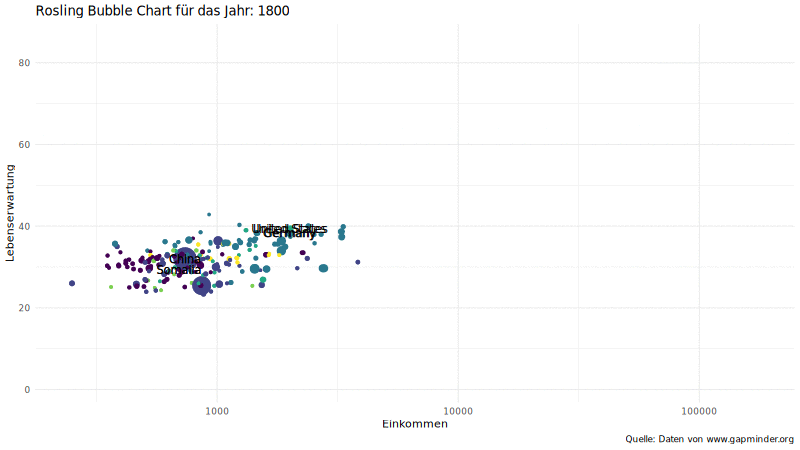

```{r setup, include=FALSE}
options(htmltools.dir.version = FALSE)
knitr::opts_chunk$set(warning = FALSE, message = FALSE, 
  comment = NA, dpi = 300,
  fig.align = "center", out.width = "70%", cache = FALSE)
library(tidyverse)
library(xaringan)

# Zahlen ausschreiben
options(scipen=5)

ggplot2::theme_set(theme_minimal())
# update those defaults
update_font_defaults <- function(font_choice = "Lato") {
    ggplot2::update_geom_defaults("text", list(family = font_choice))
    ggplot2::update_geom_defaults("label", list(family = font_choice))
    
}
theme_bakeoff <- function(font_choice = "Lato"){ 
  
  update_font_defaults()
  
  ggplot2::theme_minimal(base_family = font_choice)
  
}
ggplot2::theme_set(theme_bakeoff())

gif_link <- function(link, file, size){
    knitr::asis_output(
      paste0('<center>\n<a href="',
             link,
             '">\n\n</a>\n</center>'
      ))
}
```

# Roslings Bubble Chart

<iframe width="800" height="450" src="https://www.youtube.com/embed/Z8t4k0Q8e8Y" frameborder="0" allow="accelerometer; autoplay; encrypted-media; gyroscope; picture-in-picture" allowfullscreen></iframe>

.small[Quelle: Hans Rosling auf Youtube: https://youtu.be/Z8t4k0Q8e8Y]

```{r, echo=FALSE, eval=FALSE}
# Datensatz erstellen
library(readxl)
library(tidyverse)

# Bevölkerung
download.file("https://docs.google.com/spreadsheets/d/14_suWY8fCPEXV0MH7ZQMZ-KndzMVsSsA5HdR-7WqAC0/export?format=xlsx", "data/Bevoelkerung.xlsx")
bev <- read_xlsx("data/Bevoelkerung.xlsx", sheet = "data-for-countries-etc-by-year") %>%
  rename(Bevoelkerung = Population)

# Lebenserwartung
download.file("https://docs.google.com/spreadsheets/d/11mulzUH3_cueq-V9D5KIlo9oHE9YYZrUSeVyCin7_rM/export?format=xlsx", "data/Lebenserwartung.xlsx")
leben <- read_xlsx("data/Lebenserwartung.xlsx", sheet = "data-for-countries-etc-by-year") %>%
  select(-name) %>%
  rename(Lebenserwartung = `Life expectancy`)

#Einkommen
download.file("https://docs.google.com/spreadsheets/d/10vHiHnBQre07TwX75vTc_H1lf-w5-hbe5mZH4ro6QNE/export?format=xlsx", "data/Einkommen.xlsx")
einkommen <- read_xlsx("data/Einkommen.xlsx", sheet = "data-for-countries-etc-by-year") %>%
  select(-c(name, `GDP total`)) %>%
  rename(Einkommen = `Income per person`)

# Match zwischen Land und Kontinent
download.file("https://pkgstore.datahub.io/JohnSnowLabs/country-and-continent-codes-list/country-and-continent-codes-list-csv_csv/data/b7876b7f496677669644f3d1069d3121/country-and-continent-codes-list-csv_csv.csv", "data/Land-Kontinent.csv")
kontinent <- read_csv("data/Land-Kontinent.csv") %>%
  mutate(geo = str_to_lower(Three_Letter_Country_Code)) %>%
  rename(continent = Continent_Name) %>%
  select(geo, continent) %>%
  distinct(geo, .keep_all = TRUE) # Manche Länder haben Zuweisungen zu mehreren Kontinenten. Wir behalten nur eine davon

opec <- c("Algeria","Angola","Ecuador","Iran","Iraq","Kuwait","Libya","Nigeria","Qatar","Saudi Arabia","United Arab Emirates","Venezuela")

Datensatz <- left_join(bev, leben, by=c("geo", "time"))
Datensatz <- left_join(Datensatz, einkommen, by=c("geo", "time"))
Datensatz <- left_join(Datensatz, kontinent, by="geo")

Datensatz <- Datensatz %>%
  mutate(Jahr = as.integer(time)) %>%
  filter(Jahr>=1800, Jahr<=2020, !is.na(continent)) %>%
  mutate( opec = ifelse(name %in% opec,1,0)) %>%
  rename(country = name) %>%
  select(-time)

saveRDS(Datensatz, "data/Gapminder_1800-2020.rds")

```

---

## Roslings Bubble Chart

```{r, echo=FALSE, message=FALSE, warning=FALSE, error=FALSE, eval=FALSE}

# Code from here: https://www.data-to-viz.com/graph/bubble.html

# Libraries
library(tidyverse)
library(viridis)
library(gridExtra)
library(ggrepel)
library(gganimate)

Datensatz <- readRDS("data/Gapminder_1800-2020.rds")

rosling <- Datensatz %>% 
  mutate(Bevoelkerung=Bevoelkerung/1000000,
         annotation = case_when(
           country %in% c("China", "Somalia", "Germany", "United States") ~ "yes")
  ) %>%
  ggplot(aes(x = Einkommen, y = Lebenserwartung, label = country, size = Bevoelkerung)) +
  geom_point(aes(color=continent)) +
  geom_text(data = . %>% filter(annotation=="yes"), aes(label=country), size=4) +
  scale_x_log10() +
  labs(x = "Einkommen",
       y  = "Lebenserwartung",
       caption = "Quelle: Daten von www.gapminder.org") +
  scale_size(range = c(1, 20), name="Bevölkerung in Millionen") +
  scale_color_viridis(discrete=TRUE) + 
  theme(legend.position="none") +
  # gganimate specific:
  labs(title = "Rosling Bubble Chart für das Jahr: {frame_time}") +
  transition_time(Jahr) +
  ease_aes('linear')

animate(rosling, fps = 10, width=800, height=450)
anim_save("../figs/rosling.gif")
```



---

## Einführung in ggplot2

- Grafiken nutzen zur Veranschaulichung von Sachverhalten
- Explorative Datenanalyse um die Daten kennen zu lernen
    - wird häufig vernachlässigt
    - Fehler oder unerwartete Probleme können häufig durch eingehende visuelle Datenanalyse vermieden werden
- Nutzen des Pakets [`ggplot2`](http://ggplot2.org) und `dplyr`
- Das [Cheat Sheet](https://www.rstudio.com/wp-content/uploads/2015/03/ggplot2-cheatsheet.pdf) zu ggplot2
  - Ein deutsches [Cheat Sheet](https://www.rstudio.com/wp-content/uploads/2015/06/ggplot2-german.pdf)

---

## Komponenten in ggplot2

- **Daten**: In unserem Beispiel bisher immer der `Datensatz` Datensatz 
- **Geometry**: Verschiedene Arten von Grafiken, z.B. Streudiagramm, Boxplot, Histogramm, Kerndichteschätzung
- **Aesthetic**: Definieren was die x-Achse und was die y-Achse zeigen soll. Weiterhin können wir Farben und Formen unserer Grafik bestimmen, alles abhängig von der **Geometry**, welche wir wählen
- **scale**: Definieren wie die Skalierung unserer x-Achse und y-Achse sein soll (eventuell logarithmisch?)

Mittels der nächsten Folien wollen wir eine Grafik Schritt für Schritt erzeugen

---

## Generierung eines leeren `ggplot` Objekts


Zuerst generieren wir uns ein leeres `ggplot` Objekt, in welchem wir definieren, welche Daten wir zeigen wollen.

- Dadurch erhalten wir eine graue Box, welche von ggplot gerendet wurde

```{r ggplot-example-1}
Datensatz <- readRDS("data/Gapminder_1800-2020.rds")
ggplot(data = Datensatz)
```

---

## Layer

In diese graue Box können wir nun eine Grafik einbetten

Es gibt verschiedene Layer (Grafikarten) die wir verwenden können (hier einige Beispiele):

  - geom_bar, geom_point, geom_line, geom_smooth, geom_histogram, geom_boxpolot, geom_density

Um einen Layer hinzuzufügen nutzen wir das `+` Symbol.
Code könnte entsprechend so aussehen:


>> DATENSATZ %>% `ggplot()` + LAYER 1 + LAYER 2 + ...

---

## Layer


Angenommen Sie wollen ein Streudiagramm erzeugen, dann können Sie schauen, welcher Layer dafür geeignet ist. Das Cheat Sheet sagt uns, dass `geom_point` dafür geeignet ist.

Anschließend sollten Sie wissen, wie viele Argumente ihre Grafik benötigt um dargestellt werden zu können:

  - Gehen Sie zu der Hilfeseite von `?geom_point` und scrollen Sie zu der Überschrift `Aesthetics` um mehr darüber zu erfahren
  - Ein Streudiagramm benötigt mindestens zwei Argumente `x` und `y`

---

## Die Aesthetics Funktion `aes`
 
Mittels der Funktion `aes` kann anschließend die Grafik auf Grundlage der Daten erstellt werden
- `aes` wird oft als Argument einer Geometry Funktion verwendet

Beispiel für ein Streudiagramm mit Einkommen und Lebenserwartung für das Jahr 1800: 

```{r, eval=FALSE}
Datensatz %>% 
  filter(Jahr == 1800) %>%
  ggplot() + 
  geom_point(aes(x = Einkommen, 
                 y = Lebenserwartung))
```

- `x =` und `y =` können wir hier auch weg lassen
  - Die ersten zwei Argumente werden von ggplot automatisch als `x` und `y` aufgefasst
- Skalierung und Benennung erfolgen automatisch, wenn nicht anders spezifiziert

---

## Die Aesthetics Funktion `aes`

```{r, echo=FALSE}
Datensatz %>% 
  filter(Jahr == 1800) %>%
  ggplot() + 
  geom_point(aes(x = Einkommen, 
                 y = Lebenserwartung))
```

---

## Zusätzliche Layer 

In manchen Fällen möchten wir gerne einen zusätzlichen Layer in unsere Grafik einfügen.
Beispielsweise wollen wir jedem Datenpunkt ein Label geben, welches genau beziffert um welchen Wert es sich handelt.

- Möglich mit `geom_label` and `geom_text`
- Durch den `label` Befehl in `aes` können wir dies umsetzen
- **Beachten:** Das `label` Argument muss innerhalb von `aes` aufgerufen werden, ansonsten bekommen Sie einen Fehler

Ein Beispiel auf der nächsten Folie

```{r, eval=FALSE}
library(ggthemes)
library(ggrepel)
Datensatz %>% 
  filter(Jahr == 1800) %>%
  ggplot() + 
  geom_point(aes(Einkommen, Lebenserwartung)) +
  geom_text(aes(Einkommen, Lebenserwartung, label=country))
```

---

## Zusätzliche Layer

```{r, echo=FALSE}
library(ggthemes)
library(ggrepel)
Datensatz %>% 
  filter(Jahr == 1800) %>%
  ggplot() + 
  geom_point(aes(Einkommen, Lebenserwartung)) +
  geom_text(aes(Einkommen, Lebenserwartung, label=country))
```

---

## Weitere Argumente


- Jede Geometry Funktion hat ihre individuellen Argumente neben `aes` und `data`
- Beispielsweise kann über `size` die Größe der Punkte im Streudiagramm verändert werden

```{r, fig.width=10, fig.height=5}
Datensatz %>% 
  filter(Jahr == 1800) %>%
  ggplot() +
  geom_point(aes(Einkommen, Lebenserwartung), size = 3) +
  geom_text(aes(Einkommen, Lebenserwartung, label=country))
```

---

## Weitere Argumente

- `size` betrifft hier alle Punkte im Streudiagramm und ist nicht in der `aes` enthalten
- Sie können `size` jedoch auch auf der Basis einer anderen Variable definieren, z.B. der Bevölkerungszahl
- Nun muss die Definition von `size` jedoch innerhalb der `aes` erfolgen, da auf den Datensatz zurückgegriffen werden soll

```{r, eval=FALSE}
Datensatz %>% 
  filter(Jahr == 1800) %>%
  ggplot() +
  geom_point(aes(Einkommen, Lebenserwartung, size = Bevoelkerung)) +
  geom_text(aes(Einkommen, Lebenserwartung, label=country))
```

---

## Weitere Argumente

```{r, echo=FALSE}
Datensatz %>% 
  filter(Jahr == 1800) %>%
  ggplot() +
  geom_point(aes(Einkommen, Lebenserwartung, size = Bevoelkerung)) +
  geom_text(aes(Einkommen, Lebenserwartung, label=country))
```

---

## Weitere Argumente

- Leider können wir durch größere Punkte die Labels nicht mehr lesen
- Aus der Hilfeseite von `?geom_text` erfahren wir, wie die Labels verändert werden können:
  - Durch `nudge_x` können die Labels etwas nach rechts abgesetzt werden
  - Durch `nudge_y` können die Labels etwas nach oben abgesetzt werden

---

## Weitere Argumente

```{r, echo=FALSE}
Datensatz %>% 
  filter(Jahr == 1800) %>%
  ggplot() +
  geom_point(aes(Einkommen, Lebenserwartung, size = Bevoelkerung)) +
  geom_text(aes(Einkommen, Lebenserwartung, label = country), nudge_y = 2)
```


---

## Globale `aes` Abbildungen

- Im vorherigen Beispiel hatten wir `aes(Einkommen, Lebenserwartung)` doppelt verwendet
- Wir können statt dessen auch eine _globale_ aesthetic Abbildung erstellen
- Dies wird erreicht, indem wir als erstes eine _Grafikvorlage_ erstellen und uns eine _globale_ `aes` definieren

Wir speichern unsere _Grafikvorlage_ in `p`:

.small[
```{r}
p <- Datensatz %>% 
  filter(Jahr == 1800) %>%
  ggplot(aes(x = Einkommen, y = Lebenserwartung, label = country, size = Bevoelkerung))
```
]

---

## Globale `aes` Abbildungen

Anschließend verändern wir unser Vorlage `p` wie wir es wünschen
- Hier verändern wir nur die Größe der Punkte und Position der Labels

```{r, fig.width=10, fig.height=5}
p + geom_point() + 
  geom_text(nudge_y = 2)
```

---

## Lokale `aes` überschreiben globale `aes`

- Wir können diese _globalen_ Abbildungen durch _lokale_ überschreiben
- Beispielsweise können wir den Text _Die Menschen damals wurden nicht alt!_ auf Höhe der x-Achse bei 1500 und der y-Achse bei 50 platzieren:

```{r, fig.width=10, fig.height=5}
p + geom_point(size = 3) +   
  geom_text(aes(x = 1500, y = 46, 
  label = "Die Menschen damals wurden nicht alt!"))
```

---

## Skalierung

- Falls eine andere Skalierung gewünscht wird
  - durch `scale_x_continous` verändern wir die x-Achse
  - durch `scale_y_continous` verändern wir die y-Achse
  - durch `scale_x_log10()` verändern wir die x-Achse zu logarithmierter Skala
  - durch `scale_y_log10()` verändern wir die y-Achse zu logarithmierter Skala

---

## Skalierung

```{r, fig.width=10, fig.height=8}
p + geom_point() +  
  geom_text(nudge_y = 0.1) + 
  scale_x_log10()
```

---

## Titel und Label

- Titel oder Label können wir durch `ggtitle` bzw. `xlab`, `ylab` verändern:

```{r, fig.width=8, fig.height=4}
p + geom_point() +  
  geom_text(nudge_y = 2) +
  scale_x_log10() +
  xlab("Einkommen") + 
  ylab("Lebenserwartung") +
  ggtitle("Roslings Bubble Chart für das Jahr 1800")
```

---

## Farben

- Durch das Argument `col` innerhalb von `geom_point` kann die Farbe der Punkte verändert werden
- Erstellen wir uns der einfachheit halber eine neue Grafikvorlage:

.small[
```{r}
p <- Datensatz %>% 
  filter(Jahr == 1800) %>%
  ggplot(aes(x = Einkommen, y = Lebenserwartung, 
             label = country, size = Bevoelkerung)) +
  geom_text(nudge_y = 5) +
  scale_x_log10() +
  xlab("Einkommen") + 
  ylab("Lebenserwartung") +
  ggtitle("Roslings Bubble Chart für das Jahr 1800")
```
]

---

## Farben

- Nun sollen alle Punkte blau sein

```{r, fig.width=10, fig.height=8}
p + geom_point(color = "blue")
```

---

## Farben

- Nicht unbedingt unser Ziel
- _Besser:_ Bestimmte Farben für bestimmte Gruppen
- **Schön bei `ggplot2`:** Wir können `ggplot2` eine katogoriale Variable angeben:
  - nun werden automatisch unterschiedliche Farben für alle Gruppen dieser Variablen zugeteilt
  - es wird automatisch eine Legende erzeugt

---

## Farben

```{r, fig.width=10, fig.height=8}
p + geom_point(aes(color=continent)) 
```

---

## Nur bestimmte Länder beschriften

- Es sollen nun nicht alle Ländern, sondern nur China, Somalia, Deutschland und die USA beschriftet werden.

.small[
```{r, eval=FALSE}
p <- Datensatz %>% 
  filter(Jahr == 1800) %>%
  mutate(annotation = case_when(
    country %in% c("China", "Somalia", "Germany", "United States") ~ "yes")
  ) %>%
  ggplot(aes(x = Einkommen, y = Lebenserwartung, 
             label = country, size = Bevoelkerung)) +
  geom_point(aes(color=continent)) +
  geom_text(data = . %>% filter(annotation=="yes"), aes(label=country), size=4) +
  scale_x_log10() +
  xlab("Einkommen") + 
  ylab("Lebenserwartung") +
  ggtitle("Roslings Bubble Chart für das Jahr 1800")

p
```
]

---

## Nur bestimmte Länder beschriften

```{r, echo=FALSE, out.width='50%'}
p <- Datensatz %>% 
  filter(Jahr == 1800) %>%
  mutate(annotation = case_when(
           country %in% c("China", "Somalia", "Germany", "United States") ~ "yes")
  ) %>%
  ggplot(aes(x = Einkommen, y = Lebenserwartung, label = country, size = Bevoelkerung)) +
  geom_point(aes(color=continent)) +
  geom_text(data = . %>% filter(annotation=="yes"), aes(label=country), size=4) +
  scale_x_log10() +
  xlab("Einkommen") + 
  ylab("Lebenserwartung") +
  ggtitle("Roslings Bubble Chart für das Jahr 1800")

p
```

---

## Die Größe der Länderpunkte

- Nun können Sie noch die Größe der Kreise etwas besser skalieren.
- Hier soll die Bevölkerung des größten Landes 20 mal so groß dargestellt werden wie das kleineste Land

```{r, fig.width=10, fig.height=5}

p <- p + scale_size(range = c(1, 20))

p
```

---

## Farbpalette und Legende

- Es gibt in ggplot verschiedenste Farbpaletten, hier soll die Farbpalette von viridis verwendet werden
```{r, fig.width=10, fig.height=5}
library(viridis)
p + scale_color_viridis(discrete=TRUE) + theme(legend.position="none")
```

---

## Code für die Grafik aus dem Jahr 1800

- Gesamter Code für die Grafik

.small[
```{r, eval=FALSE}
Datensatz %>% 
  filter(Jahr == 1800) %>%
  mutate(annotation = case_when(
    country %in% c("China", "Somalia", "Germany", "United States") ~ "yes")
  ) %>%
  ggplot(aes(x = Einkommen, y = Lebenserwartung, 
             label = country, size = Bevoelkerung)) +
  geom_point(aes(color=continent)) +
  geom_text(data = . %>% filter(annotation=="yes"), aes(label=country), size=4) +
  scale_x_log10() +
  xlab("Einkommen") + 
  ylab("Lebenserwartung") +
  ggtitle("Roslings Bubble Chart für das Jahr 1800") +
  scale_size(range = c(1, 20)) +
  scale_color_viridis(discrete=TRUE) + 
  theme(legend.position="none")

```
]

---

## Code für die Grafik aus dem Jahr 1800

```{r, echo=FALSE}
Datensatz %>% 
  filter(Jahr == 1800) %>%
  mutate(annotation = case_when(
           country %in% c("China", "Somalia", "Germany", "United States") ~ "yes")
  ) %>%
  ggplot(aes(x = Einkommen, y = Lebenserwartung, label = country, size = Bevoelkerung)) +
  geom_point(aes(color=continent)) +
  geom_text(data = . %>% filter(annotation=="yes"), aes(label=country), size=4) +
  scale_x_log10() +
  xlab("Einkommen") + 
  ylab("Lebenserwartung") +
  ggtitle("Roslings Bubble Chart für das Jahr 1800") +
  scale_size(range = c(1, 20)) +
  scale_color_viridis(discrete=TRUE) + 
  theme(legend.position="none")

```

---

## Animation für mehrere Jahre


---

## Zusätzliche Pakete

- Weiterhin gibt es bei `ggplot2` Zusatzpakete, durch welche wir noch einige Dinge verändern können
- Durch die zusätzlichen Pakete `ggthemes` und `ggrepel` können wir unserer Grafik noch final bearbeiten
- Beispielsweise können wir unsere Grafik mit einem anderen Grundlayout ausstatten
  - Hier dem Thema `theme_fivethirtyeight()`
  - [Hier](https://github.com/jrnold/ggthemes) finden Sie weitere Themen für ihre Grafik

---

## Zusätzliche Pakete

- Das Paket `ggrepel` stellt sicher, dass die Label eines Punktes nicht übereinander gezeigt werden
- In unserem Beispiel schwer umzusetzen, da hier sehr viele Labels vorhanden sind
- Grundsätzlich kann dies jedoch durch das laden des Pakets `ggrepel` erreicht werden
  - In der Grafik muss dann nur noch `geom_text` durch `geom_text_repel` ersetzt werden

---

## Mehrere Grafiken nebeneinander


Sie wollen mehrere Grafiken nebeneinander platzieren
- Hier hilft ihnen das Paket `gridExtra`
- Mit der Funktion `grid.arrange` aus `gridExtra` werden die Schaubilder nebeneinander gezeigt:

.small[
```{r}
p1 <- Datensatz %>% 
  filter(Jahr == 1800) %>% 
  ggplot(aes(x = Einkommen, y = Lebenserwartung, size=Bevoelkerung, color=continent)) + 
  geom_point() + 
  theme(legend.position="none")

p2 <- Datensatz %>% 
  filter(Jahr == 2018) %>% 
  ggplot(aes(x = Einkommen, y = Lebenserwartung, size=Bevoelkerung, color=continent)) + 
  geom_point() + 
  theme(legend.position="none")
```
]

---

## Mehrere Grafiken nebeneinander

```{r, fig.width=10, fig.height=5}
library(gridExtra)
grid.arrange(p1,p2, ncol = 2)
```

**Achtung:** Hier sind die Achsen für beide Grafiken nicht gleich! Diese müssen bei vergleichenden Schaubildern immer einheitlich formatiert sein!


