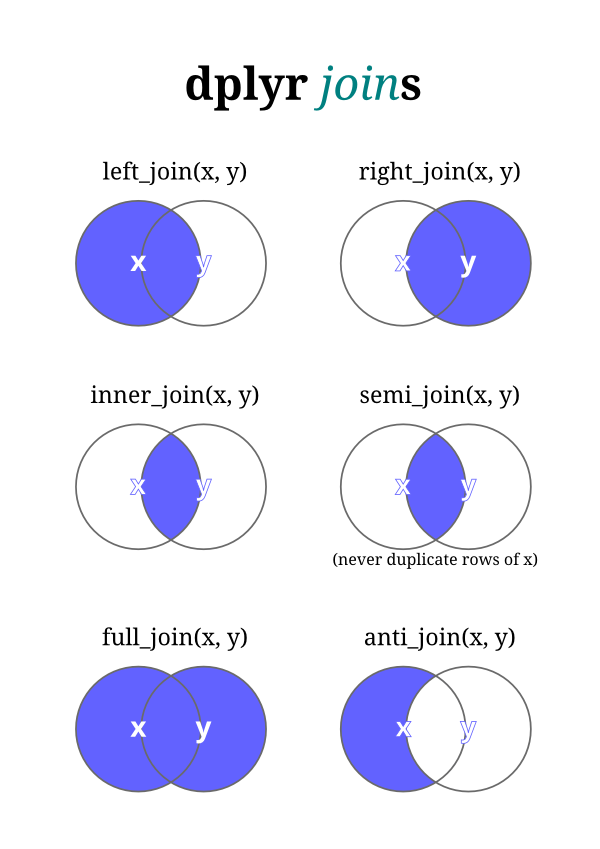

```{r setup, include=FALSE}
options(htmltools.dir.version = FALSE)
knitr::opts_chunk$set(warning = FALSE, message = FALSE, 
  comment = NA, dpi = 300,
  fig.align = "center", out.width = "70%", cache = FALSE)
library(tidyverse)
library(here)
library(knitr)
library(emo)
library(extrafont)
library(png) 
library(xaringan)

ggplot2::theme_set(theme_minimal())
# update those defaults
update_font_defaults <- function(font_choice = "Lato") {
    ggplot2::update_geom_defaults("text", list(family = font_choice))
    ggplot2::update_geom_defaults("label", list(family = font_choice))
    
}
theme_bakeoff <- function(font_choice = "Lato"){ 
  
  update_font_defaults()
  
  ggplot2::theme_minimal(base_family = font_choice)
  
}
ggplot2::theme_set(theme_bakeoff())

gif_link <- function(link, file, size){
    knitr::asis_output(
      paste0('<center>\n<a href="',
             link,
             '">\n\n</a>\n</center>'
      ))
}
```

## Datensätze laden

Wir wollen uns wieder mit den Daten zur Lebenserwartung und Geburtenrate beschäftigen und laden diese hierfür wieder in R:

```{r "Datensätze", message=FALSE, warning=FALSE}
library(haven)
library(readxl)
geburtenrate <- read_csv("data/Geburtenrate-Beispieldatensatz.csv")
leben_und_geburt <- read_xlsx("data/Geburtenrate-Lebenserwartung_Beispiel.xlsx", sheet="Lebenserwartung_Geburtenrate")
kindersterblichkeit <- read_dta("data/Kindersterblichkeit.dta")

tidy_data <- geburtenrate %>%
  pivot_longer(names_to = "jahr", 
               values_to = "geburtenrate", -country) %>%
  mutate( jahr = as.numeric(jahr))

tidy_data_extended <- readRDS("data/gapminder_life.rds")
```

---

## Grundgedanke des `join` Befehls

- `join` Befehl basiert auf den SQL joins 
    - Passende Reihen zweier Datensätze werden zusammengefügt
- **Idee**:
    - Eine oder mehrere Spalten festlegen, auf deren Grundlage die zwei Datensätze zusammengeführt werden

Nicht immer hat jede Zeile in einem Datensatz eine Entsprechung im jeweils anderen. Deshalb gibt es verschiedene `join` Befehle mit unterschiedlicher Wirkung. Das Schaubild auf der nächsten Seite verdeutlicht die Möglichkeiten.

---

```{r, echo=FALSE, out.width='55%'}

```
.center[
.small[Quelle: https://pbs.twimg.com/media/B6eUTTACUAAahLf.png]
]

---

## Verschiedene `join` Befehle

- Syntax ist auf zwei Arten denkbar:
  - als direkter Befehl, welcher beide Datensätze spezifiziert `beispiel_join(tabelle1, tabelle2)`
  - als gepipter Befehl `tabelle1 %>% beispiel_join(tabelle2)`
- [Cheat Sheet zu Datenmanipulation](https://resources.rstudio.com/rstudio-developed/data-transformation) stellt die verschiedenen Arten Datensätze zusammenzuführen grafisch dar

.instructions[Versuchen Sie sich an den verschiedenen `join` Arten und erleben Sie den Unterschied!]


---

## Beispiel für einen `left_join()`

**Ausgangspunkt:** Datensatz "tidy_data" (Geburtenrate für Deutschland und Südkorea) 

  - Zusätzlich aufnehmen: Lebenserwartung beider Länder aus dem Datensatz `tidy_data_extended`

```{r, eval=FALSE}
# Datensatz auf Jahr, Land und Lebenserwartung beschränken
tab1 <- tidy_data_extended %>% 
  select(jahr, country, life_expectancy)

join1 <- left_join(tidy_data, tab1)

head(join1,2)
```

--

```{r, echo=FALSE}
# Datensatz auf Jahr, Land und Lebenserwartung beschränken
tab1 <- tidy_data_extended %>% 
  select(jahr, country, life_expectancy)

join1 <- left_join(tidy_data, tab1)

head(join1,2)
```

--

.question[Wäre right_join anders und wie würde dieser aussehen?]

---

## Beispiel für einen `right_join()`

```{r, eval=FALSE}
test <- right_join(tidy_data, tab1)

head(test,2)
```

--

```{r, echo=FALSE}
test <- right_join(tidy_data, tab1)

head(test,2)
```

Wieso steht nun Brasilien ganz oben, wo ist Deutschland?

--

```{r}
test %>% filter(country=="Germany") %>% head(2)
```

---

## Zusammenheften verschiedener Datensätze

- Neben dem `join` Befehl gibt es die Möglichkeit Datensätze auch aneinander zu kleben
- Es wird _nicht_ versucht auf der Grundlage von verschiedenen Variablen die Datensätze zusammen zu bringen
- Gleich lange Datensätze werden einfach nebeneinander gestellt und zusammengeführt (bei `bind_cols`) bzw. untereinander gestellt (bei `bind_rows`)
- Z.B. bei Zeitreihen nützlich wenn immer ein neues Jahr als Update angefügt wird

---

## `bind_cols()`

- Durch den Befehl `bind_cols()` können mehrere Spalten zu einem Tibble zusammengeführt werden.
- Beispielsweise können Sie folgen Tibble erstellen
  - Ein Datensatz mit die Geburtenrate in Deutschland zwischen 2000 und 2010
  - Ein Datensatz mit der Kindersterblichkeit in Deutschland zwischen 2000 und 2010
- Danach beide Datensätze verbinden

--

```{r, eval=FALSE}
geburt_dtl <- tidy_data %>% 
  filter(country=="Germany", jahr>=2000 & jahr<=2010)

sterblich_dtl <- kindersterblichkeit %>% 
  filter(Country=="Germany", Year>=2000 & Year<=2010)

deutschland <- bind_cols(geburt_dtl, sterblich_dtl)
```

--

```{r, echo=FALSE}
geburt_dtl <- tidy_data %>% filter(country=="Germany", jahr>=2000 & jahr<=2010)
sterblich_dtl <- kindersterblichkeit %>% filter(Country=="Germany", Year>=2000 & Year<=2010)

deutschland <- bind_cols(geburt_dtl, sterblich_dtl)

head(deutschland, 4)
```

---

## `bind_rows()`

- `bind_rows` können Sie nutzen um mehrere Reihen untereinander zu heften
- Beispiel mit dem Datensatz zur Geburtenrate:
  - Ein Datensatz zur Geburtenrate von 1950 bis 1980 verfügbar
  - Einen weiteren Datensatz zur Geburtenrate von 1981 bis 2015 verfügbar
  - Durch `bind_rows` können diese Datensätze verschmolzen werden

```{r}
tidy_data.sub1 <- tidy_data %>% filter(jahr >= 1950 & jahr <= 1980)
tidy_data.sub2 <- tidy_data %>% filter(jahr >= 1981 & jahr <= 2015)
tidy_data.komplett <- bind_rows(tidy_data.sub1,tidy_data.sub2) %>% 
  arrange(country, jahr)
```

Testen ob `tidy_data` und `tidy_data.komplett` identisch sind:
--

```{r}
identical(tidy_data,tidy_data.komplett)
```