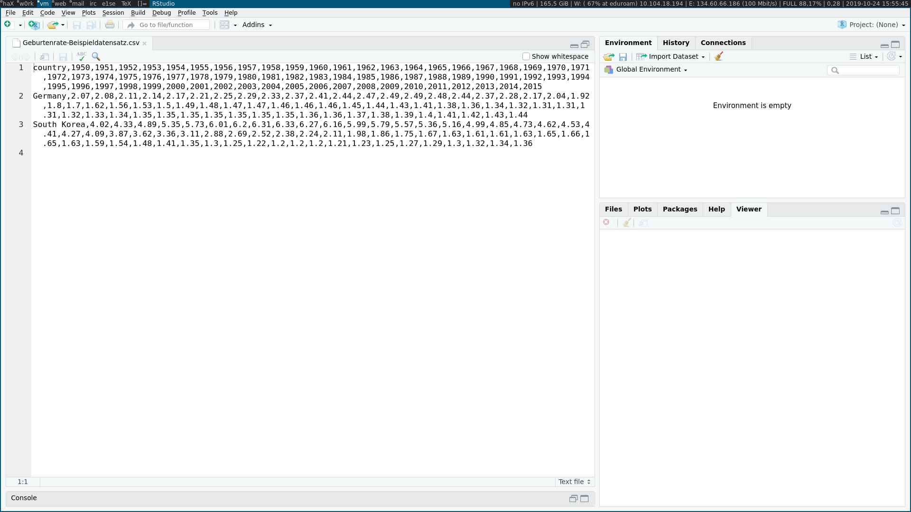

```{r setup, include=FALSE}
options(htmltools.dir.version = FALSE)
knitr::opts_chunk$set(warning = FALSE, message = FALSE, 
  comment = NA, dpi = 300,
  fig.align = "center", out.width = "70%", cache = FALSE)
library(tidyverse)
library(here)
library(knitr)
library(emo)
library(extrafont)
library(png) 
library(xaringan)

ggplot2::theme_set(theme_minimal())
# update those defaults
update_font_defaults <- function(font_choice = "Lato") {
    ggplot2::update_geom_defaults("text", list(family = font_choice))
    ggplot2::update_geom_defaults("label", list(family = font_choice))
    
}
theme_bakeoff <- function(font_choice = "Lato"){ 
  
  update_font_defaults()
  
  ggplot2::theme_minimal(base_family = font_choice)
  
}
ggplot2::theme_set(theme_bakeoff())

gif_link <- function(link, file, size){
    knitr::asis_output(
      paste0('<center>\n<a href="',
             link,
             '">\n\n</a>\n</center>'
      ))
}
```


class: center, middle


.small[Quelle: Wickham, H., & Grolemund, G. (2016). R for data science: import, tidy, transform, visualize, and model data." O'Reilly Media, Inc.]

---

## Einführung

Bisher hatten Sie sich mit bestehenden Datensätzen in Form von R Objekten beschäftigt

In den Projekten sind Dinge wichtig wie:

- Zusammenfügen von Informationen aus verschiedenen Datenquellen
- Bereinigen des Datensatzes (falsch ausgefüllte Fragebögen, Codierung von Zeitreihen in Datastream, ...)
- Konsistenzchecks (Outlier, doppelte Beobachtungen, ...)

.alert[Dies wollen wir nun lernen.]

---

## Daten einlesen

- Es ist selten, dass Sie in ihrer Analyse auf bereits bearbeitete Datensätze stoßen
- *Meistens:* Daten müssen aus Excel, Text, Datenbank, API, HTML ... importiert werden
  - Sie können sich Excel- und Textdateien aus den meisten Datenbanken generieren lassen (DAFNE, Datastream, Bloomberg ...)
  - Pakete `readr` and `readxl` können uns bei Excel und Textdateien helfen
  - Paket `rvest` kann uns bei HTMLs helfen
  - Paket `haven` kann uns bei anderen Formaten wie z.B. Stata-Dateien helfen


---

## Daten einlesen

- Sie sollten Datensätze grundsätzlich _nicht_ in Excel abspeichern
- Vorteil von ".csv" (comma-separated value) oder ".txt" (tab-separated value) Dateien:
  - Sie sind plattformunabhängig lesbar (UNIX/Windows/MAC)
  - Sie benötigen kein lizenziertes Programm um den Datensatz öffnen zu können  
  - Der Datensatz wird im ASCII Format abgespeichert, wodurch er in jedem Texteditor begutachtet werden kann
  - Reproduzierbarkeit der Analysen durch Datengrundlage gegeben

--

.instructions[Deshalb gilt: Datensätze bitte **immer** in ".csv" oder ".txt"-Format abspeichern!]

.alert[**Außnahme:** Sie arbeiten nur mit anderen R-Nutzern zusammen, dann können die Daten in .Rds abgespeichert werden.]

---

## Daten einlesen

Um Dateien einzulesen sollten Sie drei Dinge wissen:

- Wo befinden Sie sich aktuell in ihrem System?
  - Aktuelles _Arbeitsverzeichnis_ mit `getwd`
- Wo befindet sich die einzulesende Datei?
  - Pfad zur Datei mit `file.path`
- Welches Format hat die Datei?
  - ".csv", ".txt", ".xls(x)", ".dta" ...

---

## Das Arbeitsverzeichnis

- Wo befinden Sie sich aktuell und wie kann das _Arbeitsverzeichnis_ geändert werden
```{r, eval=FALSE}
getwd()
```

.question[Laden Sie das [Git-Repository mit den Vorlesungsunterlagen herunter](https://github.com/AlexRieber/datascience-teaching). Anschließend wechseln Sie ihr Arbeitsverzeichnis in R zu dem Ordner `wrangling`.]

Wechseln Sie in den Ordner `wrangling` mit Hilfe des Befehls `setwd()`

```{r, eval=FALSE}
setwd("/Pfad/zum/neuen/Arbeitsverzeichnis") # Achten Sie auf die Anführungszeichen und Slashes!
```

--

```{r, eval=FALSE}
setwd("/home/rieber/datascience-teaching/2020/wrangling/") # Pfad bei UNIX
setwd("C:/Users/rieber/Desktop/datascience-teaching/2020/wrangling/") # Pfad bei Windows 
setwd("/Users/rieber/Desktop/datascience-teaching/2020/wrangling/) # Pfad bei Mac

#Check des Pfades
getwd()
```

---

## Beispieldatensätze herunterladen und einlesen

.question[Welche Datensätze befinden sich in dem Unterordner _data_?]

```{r, eval=FALSE, echo=FALSE}
#Erstellen von Kindersterblichkeit.dta aus Kindersterblichkeit.xlsx
library(haven)
data <- read_xlsx("Kindersterblichkeit.xlsx", sheet = "Data & sources by observation")
data2 <- data %>% filter(Source!="No data", Year>=1950)  %>% select(-Source)
data2 <- data2 %>% rename(Mortality = `Under five mortality`)
write_dta(data2, path = "./Kindersterblichkeit.dta", version = 14)
```

--

```{r}
list.files("data/")
```

---

## Spreadsheets einlesen

- Ein Großteil aller Datensätze werden in Spreadsheets abgespeichert
  - Ein solches Spreadsheet ist im Grund eine Datei in Data Frame-Format

```{r, echo=FALSE, out.width='100%'}

```


---

## Spreadsheets einlesen

- Enthält die Datei eine _Kopfzeile_ in der die Variablennamen definiert werden?
  - Datei sollte vor dem Einlesen betrachtet werden
    - Mit einem Editor
    - In RStudio direkt (Rechtsklick auf Datei -> Anschauen mit "Rstudio")
- Einige Spreadsheet können nicht mit einem Texteditor geöffnet werden
  - z.B. Excel-Dateien
    - Dateiformat wird häufig verwendet
    - **keine** eigenen Datensätze darin abspeichern
    - _jedoch_ dazu in der Lage sein Excel-Dateien in R einzulesen (mit `readxl` Paket)


---

layout: false
class: center, middle
name: readr

# `readr` und `readxl`

.pull-left[`r gif_link("https://readr.tidyverse.org", "../figs/readr.png", 200)`]

.pull-right[`r gif_link("https://readxl.tidyverse.org", "../figs/readxl.png", 200)`]

---

## `readr` und `readxl`

Mit den Paketen `readr` und `readxl` können verschiedene Datensätze eingelesen werden.

Für alle Datensätze, welche mit einem Texteditor geöffnt werden können, das `readr` Paket:

- read_table, read_csv, read_csv2, read_tsv, read_delim
- Beim Einlesen erhalten Sie eine Nachricht, welcher Datentyp pro Spalte erkannt wurde
- Funktionen aus dem Pakt `readr` sind deutlich schneller die build-in Funktionen von R 
  - _Nicht benutzen:_ read.table, read.csv, read.delim


```{r}
library(readr)
geburtenrate <- read_csv("data/Geburtenrate-Beispieldatensatz.csv")
```

---

## `readr` und `readxl`

Für Excel Dateien gibt es das Paket `readxl` mit den Funktionen:

- read_excel, read_xls, read_xlsx
- Mit `excel_sheets` erfahren Sie welche Tabellenblätter die Datei beinhaltet
- Hier können durch `sheet` einzelne Tabellenblätter angesprochen werden

```{r}
library(readxl)
excel_sheets("data/Geburtenrate-Lebenserwartung_Beispiel.xlsx")
leben_und_geburt <- read_xlsx("data/Geburtenrate-Lebenserwartung_Beispiel.xlsx", sheet="Lebenserwartung_Geburtenrate")
```

---

## `readr` und `readxl`

Sowohl `readr` als auch `readxl` Datensätze werden als `tibble` (eine aktualisierte Form eines Data Frame) eingelesen

.pull-left[
```{r}
geburtenrate %>% 
  select(1:4) %>%
  head(4)
```
]

.pull-right[
```{r}
leben_und_geburt %>% 
  select(1:4) %>%
  head(4)
```
]
---

## Unterschied zwischen `readr`, `readxl` und Base R

.pull-left[
**`readr` und `readxl`**

- Die von `readr` eingelesenen Daten werde als `tibble` abgespeichert-
- `readr` erkennt automatisch Faktorvariablen und kann String- und Faktorvariablen unterscheiden
- Datum und Zeit wird durch das `readr` Paket direkt erkannt und in ein R Datum umgewandelt
- Das Einlesen durch `readr` ist ~10 mal schneller als in den Basisfunktionen
]

.pull-right[
**Base R**

- Die Basisfunktionen (read.csv, read.table oder read.delim) speichern die Daten als Data Frame 
- Die Basisfunktionen lesen String-Variablen als Faktorvariablen ein
- Datum und Zeit werden nicht erkannt und müssen manuell umgeformt werden
]

---

## Das `haven` Paket

- Neben Excel und R wird in der Wirtschaft und Wissenschaft oft Stata, SPSS und SAS eingesetzt
- Durch das `haven` Paket können auch diese Datensätze eingelesen werden
- Das `haven` Paket bringt Flexibilität, denn hierdurch können Sie:
    - mit Personen kooperieren, welche Stata verwenden
    - Stata-Datensätze einlesen, welche oft mit Artikeln in Fachzeitschriften veröffentlicht werden

```{r, message=FALSE, error=FALSE, warning=FALSE, eval=FALSE}
library(haven)
kindersterblichkeit <- read_dta("data/Kindersterblichkeit.dta")

head(kindersterblichkeit,4)
```

--

```{r, message=FALSE, error=FALSE, warning=FALSE, echo=FALSE}
library(haven)
#Beispieldatensatz aus "haven" Paket kopieren
kindersterblichkeit <- read_dta("data/Kindersterblichkeit.dta")

head(kindersterblichkeit,4)
```

---

## Probleme beim Einlesen von Daten

Wenn Sie Daten in R einlesen kann einiges schief gehen.

Hier einige Beispiele:

- Datensätze können mehrere Kopfzeilen enthalten
- Datensätze können in einem ungünstigen Format abgespeichert sein
- Zellen können leer sein
- Die Kodierung kann anders sein als erwartet
  - Bzgl. der Kodierung, insbesonder im Hinblick auf Unicode ist [dieser Blogeintrag](https://www.joelonsoftware.com/2003/10/08/the-absolute-minimum-every-software-developer-absolutely-positively-must-know-about-unicode-and-character-sets-no-excuses/) sehr interessant
